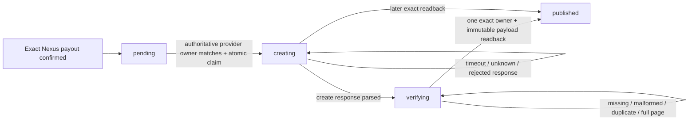
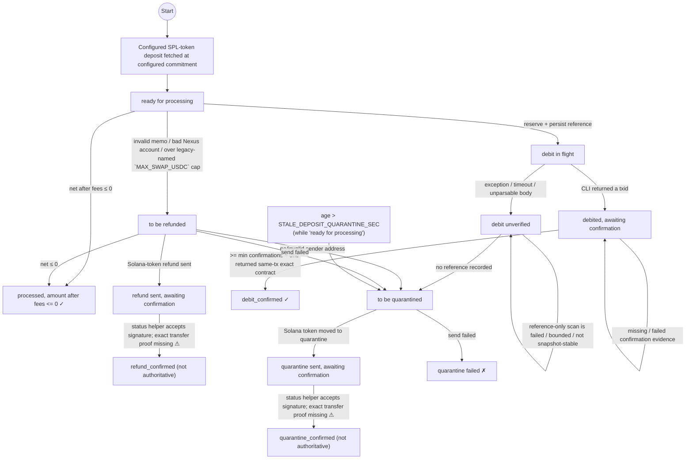
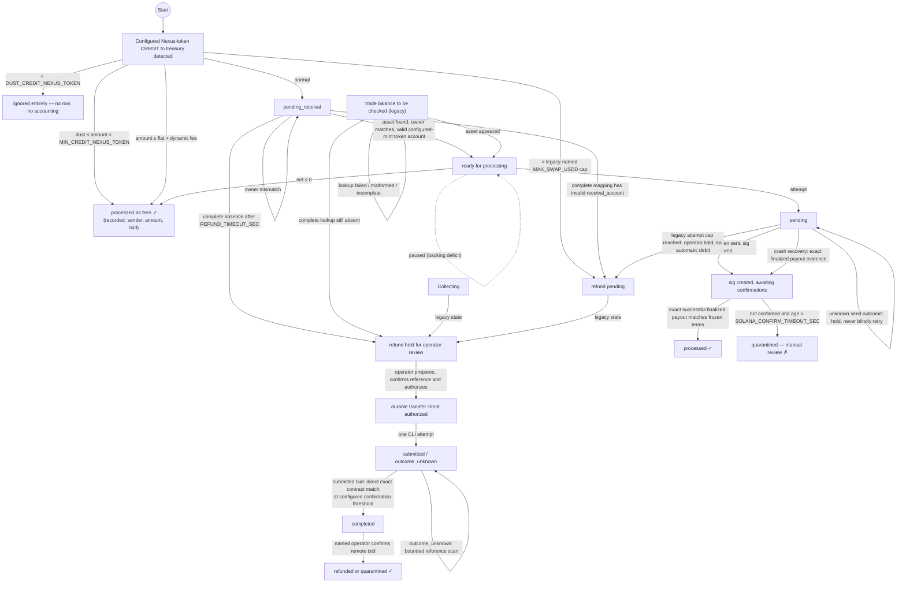

# Pre-repair documentation snapshot — 2026-09-13

Historical reference only. These complete snapshots preserve the existing staged and unstaged evaluation and architecture notes before consolidation. They are not the current issue register; see [EVALUATION.md](EVALUATION.md) and [STATE_MACHINES.md](STATE_MACHINES.md).

## Evaluation snapshot

# swapService — Current Engineering Evaluation and Remediation Plan

**Date:** 2026-09-12
**Documentation/code comparison baseline:** `d0acd721d4af534c2b1313565ff3677cfb59e73e` (`main`, matching `origin/main` at review start), compared with the `3bd8f23f60c1658816ddb986c701ec81a6777143` source snapshot reviewed on 2026-09-10. The delta contains eight commits, 24 files, 1,227 insertions and 208 deletions.
**Status:** Current issue register and repair priority for `swapService`
**Architecture-plan update:** 2026-09-12 follow-up: `50d88ba` and `b392059` contain omitted disposition spending by refusing startup; automatic reconstruction remains unavailable. The subsequent local [live-ingestion repair](POST_CHANGE_REVIEW_2026-09-12_INGESTION.md) contains silent scan failures, truncation and explicit failed-deposit admission. Receipt, exact deposit normalization and live-chain acceptance remain open; provider-v2 remains planned.

This document replaces the old June code-level audit as the current engineering evaluation. Historical findings and their original line references remain available in [`AUDIT_FINDINGS.md`](AUDIT_FINDINGS.md) and [`RISK_ASSESSMENT.md`](RISK_ASSESSMENT.md). The [2026-09-12 independent review](DEVELOPMENT_REVIEW_2026-09-12.md) is the current executed evidence. The [2026-09-10 review](DEVELOPMENT_REVIEW_2026-09-10.md) and [post-change report](POST_CHANGE_REVIEW_2026-09-07.md) retain their snapshot results. Dated sections 10–16 below are historical snapshots, not current open-finding assertions. Current candidate verification must include the documentation and index-aware inventory; no live-chain approval is implied.

## 1. Executive verdict

**Do not deploy against real funds.**

The repair work through the evaluated head materially improved the bridge:

- failed, empty, malformed and truncated debit/reference lookups no longer authorize automatic retry or refund;
- receival-asset lookup distinguishes complete absence from lookup failure;
- incomplete receival lookups hold rather than entering the refund path;
- unresolved Solana deposits are deducted from backing and spendable surplus;
- backing and circulating-supply errors fail closed;
- non-idempotent automatic surplus actions are disabled;
- recognized CLI, parse, page-budget and empty-response failures hold the Nexus waterline;
- the processing pass never proposes a Nexus checkpoint;
- every unsafe automatic Nexus refund path now holds and alerts for operator review;
- the heuristic Nexus server-side amount filter has been removed from normal and recovery scans;
- exact integer money math covers unequal-decimal pairs in both directions;
- startup no longer reports a returned unhealthy reconciliation as green;
- interrupted claimed Nexus transfers restart as durable `outcome_unknown` holds;
- explicit production mode requires positive per-swap/daily caps and an alert route;
- reconciliation errors and unhealthy results latch an exposure pause until an explicit healthy read-back;
- invalid production-mode text is rejected and admission refusal exits non-zero;
- submitted Nexus transfer txids cannot be replaced;
- unsafe dormant Nexus DEX, automatic fee-conversion and direct account-debit paths are removed;
- Nexus/Solana money-path diagnostics are structured and secret-redacted;
- one composable pytest command exists and is green locally.

Those controls are valuable. They do not make the service production-ready.
The 2026-09-07 review verifies that incoming live/recovery admission and the four Nexus lifecycle
queues/archives now preserve `(txid, contract_id)`, including valid sibling CREDITs, and that the
recovery producer rejects malformed qualifying credit identity, amount and finality fields. These
are real local repairs to the 2026-09-05 Critical admission and malformed-scan findings.

Composite source identity now extends through operator intents, references, audit, CLI selection and
atomic sibling-scoped finalization. A held source is revalidated before execution and cannot also
be claimed for a Solana payout. Strict payout memo/evidence reconstruction and an explicit startup
recovery refusal gate replace the old duplicate-payment and log-and-continue paths. Multi-page
mutable offset enumeration holds live checkpoints as well as refusing recovery completeness.
Fees are uniquely attributable per source contract and atomically committed with terminal state;
payout terms are frozen before submission and matched to full successful finalized Solana transfer
evidence before finalization. The submission helper cannot write a sparse terminal source. Legacy/ambiguous
evidence remains held. These are local code repairs, not target-chain production evidence.

### Current release-gate summary

| Gate | Status |
|---|---|
| Exact source identity; sibling disposition isolation | Repaired locally; explicit legacy holds remain |
| No blind retry after an ambiguous financial operation | Local intent/claim and recovery gates enforced; live timeout/crash proof required |
| No checkpoint from incomplete enumeration | Nexus multi-page mutable polls hold. The local Solana repair rejects known RPC/schema failures, unreadable transactions and bounded scans lacking completion; current core scanning holds on saturated pages. Durable paginated backfill and target-provider completeness/ordering remain release gates. |
| Live payout evidence matches frozen intent | Direct-signature and memo-recovered paths require exact finalized source identity, vault, mint, recipient and output; re-review evidence is recorded in the post-change report |
| Atomic fee and terminal source state | Implemented with rollback, replay and frozen-term fixtures |
| Installed-SDK recovery request construction | Signature-typed transaction lookups and recovery cursor are locally verified through real SDK encoders with a mocked provider; target-chain acceptance remains required |
| Exact mixed-decimal money math | Existing local regression coverage retained; target-chain matrix required |
| Rolling Solana payout cap | **Contained locally / recovery availability incomplete:** `50d88ba` holds on recognized current dispositions; the follow-up also holds on unclassified, opaque, nested or ambiguous vault spending and incomplete spend schemas. Recovery cannot declare completeness for these cases or reach payout workers. Full automatic disposition reconstruction remains unavailable. Primary cap refusal is visible; disposition cap refusal remains generic/log-only. |
| Optional public receipt assets | Exact readback, NXS reservation and receipt-capable provider admission exist; **keep disabled**. A transient provider-owner lookup at payout finalization deliberately archives the payout without creating any durable receipt/outbox row, permanently losing that enabled-feature obligation. |
| Complete local engineering gate | Recovery follow-up candidate passed dependency consistency, byte-compilation, links, 286-line disposable-index inventory, whitespace and **310 tests plus 53 subtests**; all configured isolation shards passed. Real staged work was preserved. See the linked repair evidence. |
| Exact-head CI and live devnet/testnet matrix | `b392059` is published on `origin/main` and exact-head CI run `34711667411` passed. No independent approval or live-chain matrix is claimed. Production remains blocked. |

---

## 2. Critical deployment blockers

### E-014 — Incoming Nexus contract identity is not end to end

**Severity:** Critical
**Priority:** P0 — repair before operator disposition or wipeout recovery can be trusted

**Current status: locally repaired; live and legacy-resolution gates remain.** The new migration
adds exact source identity to transfer intents and fee evidence, preserving outbound contract identity
separately. CLI selection requires the exact source contract; source validation, audit and finalization
preserve siblings and reject conflicting evidence. Legacy intents are retained but cannot authorize,
claim or finalize a fresh debit. Strict composite payout parsing and positive source/output evidence
replace synthetic txid markers during reconstruction. Startup cannot proceed from incomplete recovery.
Per-contract fee classification, terminal state and queue removal are one atomic transaction.

The following exit criteria remain the governing acceptance specification; local fixtures are listed
in the post-change report and do not replace target-node verification.

#### Required exit

1. Add immutable `source_contract_id` to every transfer intent and audit/operator command; derive the
   intent id/reference from both source fields.
2. Read, archive and delete only the exact held source identity in one transaction; never default a
   current-chain terminal row to `-1`.
3. Define and strictly parse a versioned payout memo carrying txid and contract id; retain an explicit
   manual path for legacy txid-only memos.
4. Prove two held siblings can be independently finalized and a wipeout cannot requeue an already-paid
   sibling while still recovering an unpaid sibling.
5. Add source contract identity to fee evidence and make fee classification plus terminal state atomic.

---

### E-001 — Nexus refunds are not crash-safe or idempotent

**Severity:** Critical
**Priority:** P0 — contain immediately, then implement durable protocol

**Current status: automatic execution contained; exact-source durable operator protocol repaired locally.**
Automatic Nexus refunds and quarantine movements remain disabled. The operator path now requires
`--txid` and `--contract-id`; intent references, uniqueness, authorization and finalization bind that
exact held source. Source and terminal/payout conflicts are rechecked under the database transaction
before any single-use execution claim. Finalization preserves sibling rows and requires stored remote
identity. Legacy txid-only intents retain evidence and remain manual holds, blocking a guessed fresh
debit for that txid. Interrupted execution becomes `outcome_unknown`, never a fresh attempt.

Do not enable operational transfers until the target-node crash/finality matrix passes.

**Independent follow-up remediation (2026-08-31):** every resolver now holds when its bounded
reference lookup is incomplete, normalizes Nexus `from`/`to` endpoint objects to immutable register
addresses, compares the configured token register address rather than a display name, and persists
`contract_id` with terminal state. A transfer intent that already has the txid returned by its sole
submitted debit resolves that exact transaction through `ledger/get/transaction`, requiring one
contract that matches its persisted reference, endpoints and integer units; malformed/mismatched
read-back remains held. Reference-only ambiguous outcomes still require complete stable-range
evidence. These are local fail-closed repairs; target-node query/pagination semantics and the live
matrix remain required before enabling the operator protocol.

Focused fault injection and target-node evidence are still required; the transfer primitive remains
fail closed outside the durable-intent workflow.

**Historical root cause (pre-intent ledger):** `refund_nexus_token()` called
`transfer_nexus_between_accounts()` directly. The operation:

- wrote no durable refund intent before `finance/debit/account`;
- did not persist a returned Nexus transaction id;
- mapped CLI timeout, exception and non-zero result to `False`, even though the node may have accepted the debit;
- performed no on-chain reference lookup before a retry.

The direct transfer function is now a fail-closed legacy shim; only
`execute_nexus_transfer_intent()` can form an account debit, and only from a prepared durable
intent. Automatic callers still do not invoke it. The legacy refund and quarantine preparation
wrappers also reject anything other than a positive built-in integer base-unit value before
creating an intent; they do not coerce a float, `Decimal`, boolean or string into a different
Nexus debit amount.

Before containment, four automatic refund paths called that boolean operation and retried it. A
process crash or timeout after Nexus accepted the refund but before a local completion write
could therefore send the same refund twice. Those paths now only hold and alert.

The prior `is_processed_txid()` check never provided refund idempotency: the source credit
remained in `unprocessed_txids`, while a completed refund was archived elsewhere. The durable
intent row and its reference now carry that identity explicitly.

#### Immediate containment

Disable automatic Nexus refunds. Hold affected rows for operator review and alert with txid, sender, amount, reason and age. This reduces availability but removes the double-refund path while the durable protocol is built.

#### Required permanent repair

1. Persist refund intent before the Nexus debit: source txid, destination, exact base units, unique reference, attempt timestamp and status.
2. Execute the debit using that persisted reference.
3. Treat timeout, process interruption, non-zero exit and unparsed output as `outcome_unknown`.
4. Resolve the reference on-chain before retrying, marking complete or quarantining.
5. Persist the Nexus refund txid before removing the source queue row.
6. Never infer non-execution from a bounded or failed history scan.

#### Exit criteria

- Crash between debit and local completion cannot produce a second refund.
- Timeout after a simulated accepted debit holds and resolves; it never retries blindly.
- Restart recovery reconstructs every refund intent.
- Tests cover accepted/parsed, accepted/unparsed, timeout-before-submit, timeout-after-submit, crash, restart and duplicate invocation.

---

### E-002 — Default heuristic Nexus filtering can hide credits and still advance the waterline

**Severity:** Critical deployment blocker
**Priority:** P0 — remove before any live-fund run

**Current status:** **contained locally; target-node evidence outstanding.** The setting and both
heuristic `where=contracts.amount...` construction paths have been removed. Normal polling
and recovery now enumerate without a server-side amount predicate and apply dust/minimum
policy locally. An empty successful poll response now holds rather than proposing `now - safety`,
because it cannot independently prove a complete, snapshot-stable range. Regression tests assert
that no `where=` argument is sent even when a legacy flag is injected into the test configuration
and that an empty page cannot advance the waterline.

The remaining release gate is stable target-node history coverage. Multi-page mutable offset
recovery explicitly returns incomplete; live polling holds its checkpoint after requesting any
nonzero offset, even if a later page is short or empty. Positive credits may still be persisted.
Two identical scans do not establish a snapshot. The preserved repeatability regression is retained.
Enabling multi-page checkpoint advancement or complete recovery requires an
independently verified snapshot/cursor protocol, not removal of this refusal.

#### Immediate containment

- ✅ Remove the server-side filter from normal and recovery enumeration.
- ✅ Apply dust/minimum policy locally after complete transaction capture.

#### Exit criteria

- A target-node test creates credits below dust, between dust/minimum, and above minimum; every expected credit is returned by enumeration.
- Unsupported/malformed query behavior produces an explicit incomplete scan and holds the waterline.
- Empty results hold locally unless a future target-node integration proves an independently stable, complete range.
- Pagination, processing caps and concurrent new transactions cannot move the checkpoint past an unpersisted credit.

---

### E-015 — Rolling Solana payout cap does not cover the primary payout helper

**Severity:** Critical deployment blocker
**Priority:** P0 — enforce before real-fund admission

**Current status:** **partially repaired; exact settlement proof and primary-payout reconstruction/holds are local, but global recovery remains a Critical defect before the external gate.**
The primary Nexus→Solana path and new Solana refund/quarantine paths atomically reserve frozen output
before RPC. Pending and unknown obligations consume capacity, submission identity is append-only, and
the old read/send/best-effort-record helper is disabled for runtime callers. Concurrency and
post-send database-failure fixtures pass.

Refund/quarantine settlement now reads the submitted signature with `getTransaction` at `finalized`
commitment and requires a successful (`meta.err is null`) transaction whose direct signature, vault
signer/source, configured mint, frozen token-account recipient, integer output and versioned
`swapService:v1` disposition memo all match the durable obligation. Status-only evidence is not a
settlement input; failed or merely confirmed statuses are rejected. Pre-migration rows without the
frozen destination/memo remain held rather than using the historical status-only compatibility path.
Focused fixtures cover successful refund/quarantine settlement and failed, wrong-recipient,
wrong-amount and wrong-memo evidence.

Startup recovery now re-enumerates the complete rolling window when the Solana heartbeat
waterline is newer than its boundary. For each exact successful finalized primary payout, it restores
append-only `reserved`/`submitted`/`confirmed` budget evidence using the authoritative Solana
signature-page `blockTime`, immutable obligation identity, signature and integer output. Missing,
malformed, conflicting or incomplete evidence fails recovery closed; an older local budget event must
already describe the same obligation. The wipeout regression proves recovered primary spend consumes
the full cap and prevents admission of a second equal-cap obligation. In-place upgrades continue to
count the legacy `payouts` table without double-counting the durable confirmed event.

That reconstruction is not global. New refund and quarantine sends use
`swapService:v1:refund:<source_sig>` and `swapService:v1:quarantine:<source_sig>`, but
`scan_memos_since_timestamp()` recognizes only the legacy `refundSig:` and `quarantinedSig:`
forms. It can therefore return `complete=True` while omitting a successful current-protocol
disposition, and `_rebuild_recent_payout_budget()` restores only `nexus_payout` obligations. The
2026-09-12 offline probe reproduced both omissions. After database loss, recent disposition spend
can disappear from the rolling cap and no terminal disposition evidence is rebuilt.

Cap exhaustion atomically marks the exact primary credit `payout cap held` without freezing
payout terms or consuming capacity. The capped credit remains eligible only for the same durable
claim path, emits the rate-limited critical `solana_payout_cap_held` operator alert, and appears in
the read-only dashboard/API with its hold reason and a no-manual-retry instruction. A later successful
reservation clears the hold and proceeds normally; an operator cannot bypass the rolling limit by
reclassifying the credit.

**Remaining exit:** first recognize and strictly validate every current refund/quarantine memo and
transfer, reconstruct its exact cap and terminal/source evidence, or keep startup incomplete. Prove
mixed primary/refund/quarantine wipeout and restore cannot undercount the rolling window. Then verify
the recovery scan, restore and rolling-window boundary matrix against the target chain, including cap
exhaustion, timeout-after-acceptance, crash/restart and exact finality.

---

## 3. High-priority correctness issues

### E-003 — Mixed-decimal thresholds and published terms use the wrong scale

**Severity:** High — **remediated locally and verified in CI; target-chain evidence still required**
**Priority:** P1 — fix before claiming token-pair agnosticism

**Resolution (current branch):** fees are parsed only when exactly representable and are
stored separately in the base units of each chain-side operation. Nexus input thresholds
now derive from the Nexus representation of the Solana-output fee; Solana input thresholds
derive from the Solana representation of the Nexus-output fee. Refunds use their explicit
Solana-scale fee. `format_solana_units()` and `format_nexus_units()` format public terms
with the source-side scale, and both output calculations use integer base units end-to-end.

`tests/legacy_token_pair.py` now has exact assertions for 6/6, 8/6, 6/8, 9/6 and 0/0
decimal pairs. For each case it verifies enforced deposit/minimum/dust thresholds, both
published terms and both 10-token output calculations. The former 8-decimal Solana /
6-decimal Nexus failure now produces the intended `1.0` Nexus minimum, `0.05` dust floor
and `0.2` `min_to_nexus`, rather than `100.0`, `5.0` and `20.0`.

#### Remaining release evidence

- Run the decimal matrix against the configured target Nexus node and Solana devnet/testnet.
- Verify operator fee values are exactly representable in both configured precisions before
  deploying a non-default token pair.

---

### E-004 — Double-mint reconciliation was blind and unit-inconsistent

**Severity:** High — **partially remediated locally; release gate remains open**
**Priority:** P1 — safety detector must fail closed before deployment

The current reconciler cannot reliably discover completed mint recipients:

- `processed_sigs` stores no Nexus destination or memo (`src/state_db.py:564-592`).
- Confirmation archives the processed row and removes `unprocessed_sigs`, which held the memo (`src/nexus_client.py:386-390`).
- Reconciliation later left-joins to that deleted row to recover the destination (`src/balance_reconciler.py:79-100,146-169,276-297`).
- `run_balance_reconciliation()` may therefore check zero addresses and return no discrepancies;
  `main.py` then prints that all zero addresses match.

Its amount math is also inconsistent:

- token-unit floats are truncated with `int()` (`src/balance_reconciler.py:103-125,182-190`);
- fallback mint math uses the reverse-direction flat fee and returns float despite `-> int` (`src/balance_reconciler.py:66-72`);
- per-account failures are silently skipped (`src/balance_reconciler.py:316-325`).

Executed 10.5-token example:

- actual USDC→Nexus output: 10.3895 tokens;
- reconciler fallback: 9.9895 tokens;
- archived/comparison values truncate to whole tokens.

A green result was not evidence of balance correctness.

#### Resolution (current branch)

- Append-only SQLite migration adds `processed_sigs.amount_usdd_units`,
  `processed_sigs.nexus_destination`, and `processed_sigs.memo`; completed Nexus credits
  likewise retain `processed_txids.amount_usdd_units`.
- Confirmation persists the original memo, destination, integer Solana input and integer
  Nexus output before deleting `unprocessed_sigs`.
- Reconciliation uses only immutable completed/active evidence and exact integer base units.
  It never joins a completed row back to the transient queue, converts a token float with
  `int()`, or recomputes a historical issued output under mutable current fee settings.
- A confirmation count never terminalizes a submitted Solana→Nexus mint by itself. The service
  reads back the submitted txid's DEBIT contract and archives the mint only when exactly one
  contract matches its persisted reference, token-supply source, memo-derived destination and
  immutable integer Nexus output. Mismatched, missing or duplicate candidates remain held.
- An ambiguous Solana→Nexus debit is likewise resolved only after one remote DEBIT matches the
  persisted reference, token-supply source, memo-derived Nexus destination and exact integer
  Nexus output. A same-reference term collision remains held and cannot attach an unrelated
  Nexus txid to the Solana deposit.
- Active debit intents retain the exact Nexus output atomically with their unique reference
  before the CLI invocation. Reconciliation reads completed and active debit evidence in one
  SQLite snapshot, then consumes an exact active remote debit for a first-time recipient using
  that immutable amount. A concurrent confirmation transition or later fee configuration change
  therefore cannot report the in-flight mint as an unrecorded remote surplus. Legacy active rows
  without this evidence remain explicitly incomplete and hold exposure.
- Results include `healthy`, explicit incomplete reasons and account errors. Zero checked
  recipients, missing/malformed evidence, legacy REAL-only relevant history and per-account
  calculation failures are unhealthy. The service emits a distinct critical alert for that
  state as well as one for a confirmed positive surplus.
- Regression coverage proves a completed mint reconciles to zero after its source queue row
  is gone, a seeded extra treasury debit creates an exact positive discrepancy, and missing
  durable evidence cannot produce a green result.

#### 2026-08-28 independent-review correction

- ✅ The startup consumer now requires `healthy is True` before it prints the green balance
  message. Zero checked recipients, malformed evidence and invalid result objects emit the same
  `balance_reconciliation_incomplete` critical alert used by the periodic consumer.
- The reconciliation totals are derived from local completed tables. `include_remote_balance`
  is display-only. A crash-created duplicate remote mint need not create a second local row;
  authoritative Nexus transaction-history identity/amount read-back is still required.

#### 2026-08-29 remote-authority correction

- Commit `5d92ec0` requires one-to-one confirmed remote DEBIT evidence by txid, contract id,
  reference, source, destination and exact integer amount before reconciliation can be green.
- Every remote token-supply DEBIT is retained, including unknown recipients; unmatched emissions
  are reported as surplus, while account-to-account movements are separated by source register.
- Active mint intents are validated independently and keep the result unhealthy until terminal.
- The Nexus scan reads one page only and returns `pagination_snapshot_unavailable` when a full
  page cannot prove the requested boundary. Target short-page, ordering and boundary semantics
  remain unproven.
- SQLite REAL/TEXT money evidence is rejected, per-deposit references are immutable, duplicate
  remote identities must have identical payloads, and missing/non-integer contract ids fail closed.
- Startup and periodic reconciliation exceptions or unhealthy results now latch a fail-closed
  exposure pause. Existing refunds/quarantines continue, but new Solana deposits and Nexus→Solana
  payouts remain blocked until a later reconciliation explicitly returns `healthy=True`.

#### Remaining release evidence

- ✅ Every reconciliation error/unhealthy result latches a fail-closed exposure pause until a
  later explicitly healthy run; existing refunds and quarantines remain processable in paused mode.
- ✅ Completed historical mints remain exact-match reconcilable after a fee-policy change, and
  active first-time recipients are scanned even before any completed recipient anchors the
  token-supply source. The active-mint regressions also prove an active remote debit is held
  (not treated as a green result) without a false surplus when a later fee configuration differs
  or the confirmation worker transitions the row between its active and completed tables after
  reconciliation captures its SQLite snapshot.
- Prove the one-page boundary, short-page and ordering semantics on the target node; retain
  fail-closed behavior whenever the boundary cannot be proven.
- Execute the final reconciliation fixture matrix and authoritative transaction-history read-back
  against the configured target Nexus node and Solana devnet/testnet.
- ✅ Every local consumer, including startup, alerts unless `healthy is True`; caller-level
  regressions cover zero checked and invalid results.
- Establish a reviewed backfill/disposition procedure for existing legacy completed rows;
  they intentionally remain incomplete rather than being reconstructed from float data.

---

## 4. Medium and operational issues

### E-005 — Enforceable baseline suite and CI

**Priority:** P1, before large repair batches

**Status: baseline enforced; isolation gate remains partial.** The legacy scripts now run as pytest-managed subprocess cases, so
`python -m pytest -q` is the complete local command. GitHub Actions workflow
`.github/workflows/ci.yml` runs on pushes and pull requests and enforces dependency
consistency, byte-compilation, local Markdown-link verification, the complete pytest suite
and whitespace checking. The checked-in link verifier also caught and corrected the stale
Copilot-instructions security-document path.

The reconciliation implementation and its evaluated documentation evidence head passed GitHub
Actions run [`33258188981`](https://github.com/distordialabs-brutus/swapService/actions/runs/33258188981).
Every later production candidate still needs its own green run plus the separate live-chain matrix
in E-006. E-017 must also be closed: the current default collection order is green while standalone
and alternate module orders expose process-global test contamination.

### E-006 — No live-chain acceptance matrix

**Priority:** P1 release evidence

No test has exercised the current service against the target Nexus CLI/node and Solana devnet/testnet. The remaining highest-risk assumptions concern exactly those boundaries: CLI timeout semantics, transaction-reference fields, query/filter behavior, finality, pagination and restart recovery.

Required matrix:

- both swap directions;
- refund and quarantine;
- accepted but unparsed Nexus result;
- timeout before/after chain acceptance;
- process crash and restart at each intent/action boundary;
- pagination and processing caps;
- malformed API bodies;
- Solana finalized/confirmed behavior;
- waterline monotonicity and no skipped deposits.

### E-007 — Operator-resolution workflow exists locally but is not operationally accepted

**Priority:** P2

The fail-closed lookup changes correctly hold uncertain rows. The dashboard includes held-state
evidence, and `nexus_transfer_operator.py` now implements documented prepare → authorize →
execute-once → positive-reference resolve → exact-txid finalize with named attribution. What
remains is target-node acceptance, crash/restart rehearsal, hold aging/escalation, and a reviewed
two-person production policy. A locally executable workflow is not yet operational acceptance.

### E-008 — Nexus PIN and session are exposed in process arguments

**Priority:** P2 custody hardening — **remediated for production runtime**

The production service now sends every runtime Nexus operation requiring a profile PIN or
multiuser session through the daemon's authenticated HTTPS API rather than invoking the CLI with
`pin=` / `session=` arguments. `NEXUS_API_URL` must be a
credential-free `https` base URL and `NEXUS_API_USER` / `NEXUS_API_PASSWORD` must be set; explicit
production mode refuses startup before SQLite opens or either the Nexus/Solana poller starts when
any transport control is absent. When `NEXUS_MULTIUSER=true`, it also requires a non-empty
`NEXUS_SESSION` at that same admission gate; otherwise every session-scoped Nexus
`finance/*`/`assets/*` call would fail after the Solana-side poller starts. The form body carries
the Nexus profile PIN and, when `multiuser=1`, session identifier; they are therefore absent from
child-process argv and normal process listings. HTTP response bodies on transport errors are
deliberately discarded so a broken node cannot reflect those fields into logs.

The CLI fallback remains only for non-production local development. Operators must configure
`apiauth=1`, `apissl=1`, `apisslrequired=1`, an HTTPS API port, certificate validation, and
local/VPN/firewall network restriction on the target Nexus node. The live-node acceptance matrix
must verify those settings and the target node's POST-form semantics before deployment.

### E-009 — Exposure controls and alerting are optional by default

**Priority:** P2 operational hardening — **partially remediated locally**

`SWAP_PRODUCTION_MODE` is opt-in (so local development and testnet workflows retain their
non-production defaults). Its parser now accepts only explicit true (`1`/`true`/`yes`/`on`) or
false (`0`/`false`/`no`/`off`) spellings; a present invalid value fails configuration loading
rather than silently disabling production controls. When it is enabled, startup refuses before
opening SQLite or polling if one or both per-swap caps, the daily Solana payout cap, or both alert
routes are unset/zero. The rejection emits a `production_controls_missing` critical event naming
every missing control and the process entrypoint exits non-zero so a supervisor cannot mistake the
rejection for a clean stop.

Remaining release evidence: configure values appropriate to the vault, deliver and independently
verify at least one live alert channel, and exercise that configuration in the live acceptance matrix.

### E-013 — Pinned dependencies carried known advisories

**Priority:** P2 compatibility-tested security maintenance — **remediated locally**

The targeted remediation pins `python-dotenv==1.2.2` (CVE-2026-28684) and
`requests==2.33.0` (CVE-2024-47081 and CVE-2026-25645). A clean virtual environment installed
the complete pinned set with `solana==0.36.9` and `solders==0.26.0` unchanged; `pip check`,
`pip-audit -r requirements.txt`, byte-compilation, Markdown-link validation and the full suite
passed. The regression contract asserts the two safe pins so a future dependency edit cannot
silently restore the advisory-bearing versions.

This is deliberately a narrow HTTP/environment-layer update: Nexus HTTPS API wrappers, Solana
JSON-RPC/Jupiter callers, and the pinned Solana SDK pair were not changed. It is local compatibility
evidence only; the target Nexus node and Solana devnet/testnet matrix remains a separate release gate.

### E-016 — Opt-in receipt publication needs a financial and external-semantics gate

**Priority:** P1 before enabling receipts in production — **production admission containment is active**

The receipt payload, exact payout/fee/queue transaction, durable create claim and exact owner/payload
readback are useful local controls. Receipt creation now atomically reserves a configured maximum
NXS cost from an append-only local lifetime budget before the create boundary; timeout/crash/unknown
outcomes retain that capacity, and parseable create txid/address fields are retained as evidence.
Production startup still rejects an explicit
`NEXUS_SWAP_RECEIPTS_ENABLED=true`, so the default-off extension cannot become an uncapped NXS
spend path merely through configuration. The current upstream `ASSETS.MD` pinned at Nexus core commit
[`1185145534a20ed4d2288e4513c505f271be536d`](https://github.com/Nexusoft/LLL-TAO/blob/1185145534a20ed4d2288e4513c505f271be536d/docs/API/COMMANDS/ASSETS.MD)
states a 1 NXS asset fee plus 1 NXS for the optional name. The publisher therefore spends NXS even
though it does not move bridged tokens. The configured local budget is not proof of the target
node's actual cost, and no target-node acceptance has established an authoritative fee/transaction
readback protocol.

The fixed-field v1 registration cannot gain `receipt_schema` through normal heartbeat updates.
Receipt-enabled startup now requires that exact schema, a readable authoritative owner and immutable
pair/custody fields matching the running configuration; an existing v1 record therefore still needs a
reviewed replacement rather than an in-place update. JSON creation, global filtered query completeness,
owner/address projection and indexing delay also remain unverified on the target node. Keep receipts
disabled until cost controls, registration migration and the target-node matrix pass. Do not treat the
pinned documentation as proof of the configured live node's behavior.

The latest decoupling correctly prevents a transient receipt-provider read from blocking exact payout
settlement. It currently does so by skipping the receipt entirely: if `expected_provider_owner()` is
missing or raises during finalization, the payout is archived and no `swap_receipts` row is created.
The collected test asserts this permanent absence. An enabled publication feature therefore has no
durable outbox or replay point for that payout. Keep settlement independent, but atomically persist an
owner-independent receipt intent (or explicit publication-blocked evidence) and let the publisher
freeze/validate the authoritative owner before any NXS-spending create.

### E-018 — Current Solana dispositions are invisible to wipeout recovery

**Severity:** Critical deployment blocker
**Priority:** P0 — repair before the rolling cap or terminal reconstruction can be trusted

Refund/quarantine forward paths now emit strict versioned memos and settle only after exact finalized
transfer evidence. Startup recovery still parses only the superseded memo forms. A complete scan can
therefore omit current successful dispositions without marking itself incomplete. The global cap
restore consumes only primary `nexus_payout` evidence, so recent refund/quarantine spend is lost after
database wipeout. This is distinct from target-chain acceptance: the fail-open omission is present in
the local parser and was reproduced by a two-case offline probe.

**Required exit:** enumerate current and legacy forms explicitly; validate exact signature, success,
vault source/authority, classic SPL mint, destination, integer output, memo identity and chain
timestamp; reconstruct or conservatively hold both source terminal evidence and cap events. Unknown,
duplicate, conflicting, sparse or bounded evidence must keep startup incomplete. Add collected mixed-
kind wipeout/restore tests before the live matrix.

### E-017 — Test collection order contaminated SDK/config boundaries

**Priority:** P1 engineering gate — **remediated locally; CI verification added**

`test_critical_safety.py` no longer replaces Solana, solders, requests or dotenv modules in
`sys.modules` at collection time. Its baseline is now valid for the pinned real SDK, receipt tests
do not replace dotenv, and payout regressions import runtime modules directly instead of importing
the critical-safety module for its global state. Scanner fixtures use parseable real-SDK signatures.

The staged documentation candidate's installed-dependency default suite passes 303 tests and 33
subtests. The standalone recovery module passes 16 tests and 8 subtests; recovery→SDK passes 17 tests
and 8 subtests; and the receipt→payout→fee→SDK sequence passes 70 tests. CI is configured to run standalone recovery and the latter
sequence after the full suite. These checks prevent a future fake-module injection, invalid fixture
identity or collection-order dependency from being masked by the default order. GitHub did not expose
an Actions run for review-start SHA `d0acd72`; publication-head CI must be read back after push.

---

## 5. Low-priority cleanup

### E-010 — Stale/dead configuration and helper paths

**Remediated locally:** `DEBIT_VERIFY_GRACE_SEC` and the obsolete required `SOL_MINT` setting
have been removed from runtime configuration and current operator/state-machine documentation. The
unsafe legacy Nexus DEX listing/execution, rebalancer and direct mint helpers are also absent from
the runtime surface: no configuration edit can invoke an unaudited `market/execute/order` or
supply debit. An ambiguous Nexus debit remains held unless positive reference evidence is found;
no expiring negative-lookup setting can imply that a bounded scan proved non-execution. Solana→Nexus
decisions use only batch interfaces that expose lookup completeness; backing surplus is alert-only
for named operator review. A stale `None`/`False` result cannot be reintroduced as proof of
non-execution.

### E-011 — Documentation relocation and identity drift

**Remediated locally:** operator documents now use canonical links to the moved `docs/` security,
state-machine and audit documents. `SETUP.md` also states the fail-closed USDD→USDC mapping hold
policy, documents production Nexus API requirements (`apiauth=1`, TLS, no remote exposure), and
labels `apiauth=0` as isolated-development-only. The CI-contract regression test protects these
paths and safety statements from drifting back.
- Historical review documents intentionally retain their reviewed heads; this evaluation now
  identifies the current head and is authoritative for current status.
- Current-tree whitespace checks pass.

### E-012 — Dashboard bearer token may appear in URLs

**Status: remediated locally; verify the proxy configuration before deployment.** The dashboard
accepts `DASHBOARD_TOKEN` only through `Authorization: Bearer <token>` and no longer reads or
propagates a query-string token. This prevents the credential from appearing in URLs, browser
history, access logs and referrers. For any non-loopback bind, inject the header at a TLS reverse
proxy; do not expose the dashboard directly.

---

## 6. Architecture assessment

### Sound decisions

- SQLite state is the local source of truth and WAL/atomic reference behavior is tested.
- State-machine strings and on-disk schema are protected by compatibility tests.
- Solana sends use memos/signatures for recovery and idempotency.
- Unresolved liabilities reduce available backing.
- Automatic surplus movements are disabled until an idempotent protocol exists.
- Lookup and waterline changes now prefer a visible hold over an unsafe inferred success.
- Dashboard access is read-only at the SQLite layer.

### Architectural rule to apply everywhere

Every state-changing cross-chain action must follow the same protocol:

```text
persist intent -> execute once -> record returned identity ->
resolve ambiguous outcome against chain -> finalize local state
```

A timeout is not failure, an empty bounded scan is not absence, a finalized signature is not proof of a successful intended transfer, and a warning is not a safety control. This rule protects the repaired primary payout evidence path; it must also govern Solana refunds/quarantine transfers, Nexus dispositions, fee movements and any future automated maintenance action.

### Current configurable pair and remaining architecture work

**Implemented now:** one configurable classic-SPL-token/Nexus-token pair per deployment, with
explicit mint/register and custody settings, independent decimals, display labels, directional flat
fees, one shared basis-point rate, refund/disposition fee representations, and input minimum/dust
settings. `src/config.py` builds the immutable `SWAP_PAIR`; public record fields are derived by
`build_service_record()`. The mint recipient validator checks immutable Nexus token-register
identity, not ticker equality. USDC/USDD defaults and retained compatibility names do **not** make
the runtime a fixed-pair bridge. Current user and operator docs describe this implemented model.

**Still incomplete:** this is not arbitrary-chain/Token-2022/native-SOL support, multi-pair routing,
provider-v2 discovery or a fully versioned configuration/terms contract. Some settings remain
outside `SWAP_PAIR`, and several environment/schema names deliberately retain legacy spellings.
The conversion/backing model is 1:1 in whole-token units before fees and rounding, not market pricing.

The target architecture requires the canonical object to be passed
to every money, reconciliation, dashboard and publication path. It must contain, for each
chain side, the network/cluster, canonical token identity (Nexus register address or Solana mint),
display symbol, decimals, custody accounts and quarantine/fee destinations. Symbols are display
metadata only; no authorization, reconciliation or routing decision may compare a ticker such as
`USDD` or `USDC` when an immutable address is available.

The same configuration object must own the complete fee policy:

- independent flat output fee and proportional basis-point fee for each direction;
- configurable minimum, dust and sub-minimum retention policy for each input side;
- explicit refund, quarantine/disposition and Nexus congestion-cost policy (zero is valid);
- fee destination/account and accounting treatment;
- exact base-unit representation, effective timestamp and a terms/configuration version.

Production startup must reject missing token identities, implicit mainnet token defaults,
negative or inexact fees, fees that can consume an otherwise accepted minimum swap, mismatched
mint/account ownership, and unpublished terms. Public terms, payout math, refund math, fee-ledger
entries, dashboard labels and reconciliation must all be derived from the same validated object so
the service cannot advertise one schedule and execute another. Legacy `USDC_*`/`USDD_*` variables
may remain temporarily as migration aliases, but conflicting legacy and canonical values must fail
startup. Existing database column names and persisted lifecycle values remain frozen until an
explicit, tested migration is provided; generic configuration does not justify rewriting in-flight
fund records.

### Provider asset identity and discovery (planned; not implemented)

Using the local asset name as the heartbeat identity is the wrong long-term boundary. A local name
is scoped to a Nexus signature chain and forces name coordination, while a provider may operate
multiple swapService instances or token pairs from that chain. The target provider record therefore
uses the exact immutable attribute `"distordia-type": "swapService"` for type discovery and the
Nexus asset **address** as the canonical runtime identity. The local name becomes an optional human
alias only.

The type attribute is necessary but not sufficient for uniqueness: discovery can legitimately
return several swapService assets. Every record must also carry an immutable `service_id`, provider
owner, schema version and complete pair/custody identity. The running instance is configured with
the selected asset address, then verifies the asset owner, `distordia-type`, `service_id`, token
identities and custody addresses before reading a waterline or publishing a heartbeat. It must
never update the first type match.

One provider asset should give a user or auditor a complete, non-secret overview of the deployment:
provider/contact/source and terms links; software and schema versions; Nexus network, token register,
decimals and treasury; Solana cluster, mint, decimals and vault; enabled directions; memo/mapping
contract; all fee, minimum and cap terms; quarantine/fee destinations; status/pause reason;
liveness timestamps and per-chain safe waterlines. Volatile balances need not be copied into the
asset because the published custody addresses are independently queryable. Secrets, private RPC
URLs, PINs, sessions and key material must never be published. The proposed v2 field contract and
migration are defined in [`../ASSET_STANDARD.md`](../ASSET_STANDARD.md#provider-swapservice-asset-standard-v2-planned).

---

## 7. Prioritized development plan

The plan is sequenced by expected fund-safety value from the evaluated head. Completed
containment and engineering-gate work stays visible because every later batch depends on it.

### Batch 0 — Immediate containment **LOCALLY REPAIRED / EXTERNALLY GATED**

1. ✅ Disable automatic Nexus refunds; hold and alert instead.
2. ✅ Remove heuristic Nexus server filtering from normal and recovery enumeration.
3. ✅ Surface every held state with chain references, reason, age and safe operator guidance.
4. ✅ Bind source identity through treasury admission, recovery, operator intents and exact finalization.

**Local containment implemented:** end-to-end source identity, strict payout reconstruction and
startup refusal are covered by local fixtures. Mutable multi-page recovery is refused. The target-node
account-history, real finality and crash/restart matrix remain release gates.

### Batch 1 — Engineering and exact-money gate **PARTIAL**

1. Run legacy executable checks in isolated pytest subprocesses.
2. Make `python -m pytest -q` the complete local command.
3. Enforce dependency consistency, compilation, Markdown links, tests and whitespace in CI.
4. Implement exact integer fees, thresholds, outputs and public terms for 6/6, 8/6, 6/8,
   9/6 and 0/0 decimal configurations.
5. Remove collection-time dependency-module replacement and process-global environment leakage;
   require the payout/recovery/receipt/SDK shards to pass independently and in multiple orders.

**Local engineering exit:** the staged candidate's 303-test default installed-dependency suite plus
standalone recovery, recovery→SDK and 70-test receipt→payout→fee→SDK probes pass with the real pinned SDK; CI is configured
for the standalone recovery and receipt→payout→fee→SDK checks, but exact-head remote execution must
still be observed. The mixed-decimal contract still requires
target-chain evidence in Batch 4.

### Batch 2 — Durable completed-state model and fail-closed reconciliation **PARTIAL**

**Goal:** make a green balance result trustworthy before adding another automated money path.

1. ✅ Add append-only migration for immutable completed-swap destination, original memo and
   exact input/output base units.
2. ✅ Persist evidence before deleting the source queue row.
3. ✅ Reuse the production integer payout function; remove the duplicate float-based fee path.
4. ✅ Return `healthy` plus explicit incomplete reasons and discrepancies.
5. ✅ Treat zero expected recipients, missing context, parse errors and account failures as
   unhealthy, never green.
6. ✅ Alert separately on incomplete evidence and confirmed imbalance.
7. ✅ Add balanced, duplicate-mint, deleted-source-row and malformed-row regression cases.
8. ✅ Require exact remote Nexus token-history evidence and detect unrecorded token-supply
   DEBITs without relying on unsafe multi-page live-offset scans.
9. ✅ Resolve or terminalize a Solana→Nexus debit only from one exact DEBIT contract: every
   bounded/incomplete reference lookup holds, endpoint objects are normalized to immutable register
   addresses, the source is compared with the configured token register address, and terminal state
   retains `contract_id`. Target-node pagination and transaction-response semantics remain Batch 4
   release evidence.

**Evidence exit met locally:** a known balanced completed swap returns zero delta after its queue
row is gone; local and remote-only duplicates are detected; zero checked addresses return
`healthy=False`; historical completed mints retain their issued integer output across fee changes;
active first-time recipients are scanned and keep the result unhealthy without a false surplus across
a later fee-configuration change or a concurrent completion transition; both consumers refuse green
unless `healthy is True`; and every unhealthy or exceptional reconciliation result pauses new
Solana↔Nexus exposure while already-owed refunds and quarantines continue in paused mode. **Batch
remains partial:** target-node global-uniqueness, single-page boundary/order and transaction-response
semantics are unproven; local code holds whenever those properties cannot be established.

### Batch 3 — Durable Nexus refund and quarantine protocol **LOCALLY REPAIRED / LIVE GATE OPEN**

1. ✅ Persist exact source contract, destination, integer units and deterministic reference before execution.
2. ✅ Revalidate the held source at preparation, authorization and single-use claim; exclude competing payouts.
3. ✅ Retain remote identity; ambiguous results remain `outcome_unknown` without resubmission.
4. ✅ Resolve only attributable positive remote contract evidence, never bounded negative history.
5. ✅ Finalize terminal state, exact source removal and audit atomically without deleting a sibling.
6. ✅ Preserve legacy identities and remote/audit evidence as non-executable manual holds.
7. ✅ Persist payout terms before RPC and fee classification atomically with confirmed terminal state.

**Remaining exit:** run the target-node matrix at every acceptance and crash boundary. Review and
resolve pre-upgrade ambiguity from real chain evidence; do not relabel legacy rows to bypass a hold.

### Batch 3A — One global Solana payout-budget protocol **PARTIAL / CRITICAL GATES OPEN**

1. ✅ Add an append-only reservation/settlement ledger keyed by the exact durable obligation, not by
   a helper invocation or process-local counter.
2. ✅ Reserve rolling-window capacity in the same SQLite transaction that freezes payout terms and
   claims the source, before any RPC. Pending, submitted and outcome-unknown obligations continue
   to consume capacity.
3. ✅ Primary payouts and refund/quarantine paths require exact successful finalized transaction evidence:
   signature, vault authority/source, mint, frozen recipient, integer output and versioned memo must
   match; failed, confirmed-only and legacy unbound rows remain held. Release capacity only from
   authoritative non-execution or reviewed disposition.
4. ✅ Route primary payouts and every refund/quarantine token send through this protocol. The former
   read-then-send-then-best-effort-record helper is disabled; ledger failure holds the obligation.
5. **Partial:** two-worker contention, database-write failure, exact refund/quarantine proof and
   primary-payout wipeout reconstruction are covered locally. Recovery re-enumerates the full current
   cap window when needed, but recreates only primary-payout events; current versioned refund and
   quarantine evidence now holds startup instead of disappearing. Primary cap exhaustion creates a retryable `payout cap
   held` dashboard/API issue and emits a rate-limited critical operator alert. Refund/quarantine cap
   refusal remains in the generic source state with only a structured warning.

**Remaining exit:** successful recovery either reconstructs all recent primary, refund and quarantine
cap spend plus terminal disposition evidence or stays paused. Cap-refused dispositions need an
actionable durable reason and alert. Then execute the
target-chain matrix for cap exhaustion, timeout-after-acceptance, crash/restart and exact finality.
Aggregate reserved plus finalized outbound units must not exceed the configured window cap under
concurrency, upgrade, database restore or restart, and every accepted send must remain attributable
when its response or final local write is lost. Cap refusal must emit an actionable alert and visible hold.

### Batch 3B — Receipt publication cost and admission boundary **OPEN; FEATURE DEFAULT OFF**

1. Classify asset and optional-name creation as NXS-spending side effects in code, schema and alerts.
2. **Partly implemented locally:** bounded NXS budget, pre-create expected-cost reservation and
   parseable create identity ledger retain capacity across unknown outcomes. Establish authoritative
   target-node actual-cost readback and decide whether deterministic naming justifies its additional
   cost.
3. ✅ Receipt-enabled startup requires a readable provider record with the exact immutable receipt
   schema, authoritative owner, and configured immutable pair/custody fields. Create and rehearse a
   new fixed-field record rather than mutating v1 in place; target-node registration acceptance remains
   required.
4. Prove create, rejection, timeout-after-acceptance, delayed indexing, exact filtered readback,
   duplicates and restart on the target Nexus build.
5. Persist a receipt/outbox row for every exact payout while receipt mode is enabled even when the
   provider registration is temporarily unavailable. Do not block or reopen payout settlement; hold
   publication until the authoritative owner and immutable registration are revalidated.

**Exit:** enabling receipts cannot create uncapped operator spend or make an already-proven payout
unsettled; exact target-node readback and registration migration are demonstrated.

### Batch 4 — Live integration and external-semantics evidence

Run the full matrix on the target Nexus build plus Solana devnet/testnet:

- both swap directions and every configured decimal pair;
- refund, quarantine and manual hold disposition;
- accepted-but-unparsed results and timeout before/after acceptance;
- process crash and restart at every durable boundary;
- pagination, processing caps and concurrent arrivals;
- malformed API bodies, Solana finality and waterline monotonicity.

**Exit:** authoritative chain read-back proves no duplicate payout, skipped deposit or
checkpoint advance from incomplete evidence; startup and periodic consumers both refuse green
unless reconciliation explicitly returns `healthy=True`.

### Batch 5 — Production operational gates

1. **Partial:** explicit `SWAP_PRODUCTION_MODE` requires positive per-swap/daily payout-cap values, an
   alert route and explicit pair identities/precisions/fee terms. Forward paths reserve atomically and
   exact settlement is local, but database-loss reconstruction omits current refund/quarantine spend.
   Production remains blocked before target-chain acceptance.
2. ✅ Require configured Solana and Nexus quarantine destinations before production startup; test at least one alert channel operationally.
3. ✅ Refuse production mode when mandatory controls are absent, including the required `NEXUS_SESSION` when `NEXUS_MULTIUSER=true`.
4. Complete the operator hold-resolution workflow with evidence, authorization and audit.
5. Document incident response, recovery and key rotation; rehearse them before launch.

**Configuration gap resolved locally:** `SWAP_PRODUCTION_MODE` now accepts only explicit
true/false spellings. An unrecognized present value such as `treu` fails configuration loading,
and a production-control rejection returns `False` to the entrypoint, which exits non-zero for the
supervisor. Production admission also requires both `USDC_QUARANTINE_ACCOUNT` (a self-owned
Solana SPL token account) and `NEXUS_USDD_QUARANTINE_ACCOUNT` (the destination for a separately
authorized durable-intent disposition), preventing failed payout funds from remaining mixed with
live backing. Regression tests cover the invalid switch and both missing destinations. The remaining
Batch 5 work is operational: independently verify alert delivery, and rehearse the documented
hold-resolution, incident-response and key-rotation procedures.

### Batch 6 — Custody, dependency and maintainability hardening

1. ✅ Production uses the verified Nexus HTTPS API POST transport instead of CLI argv for PIN/session; it requires credential-free `NEXUS_API_URL` HTTPS plus API Basic credentials, while the CLI fallback remains development-only. Target-node TLS and POST-form acceptance remain live-matrix evidence.
2. ✅ Compatibility-tested and pinned `python-dotenv==1.2.2` and `requests==2.33.0` in a clean
   environment with the existing Nexus/Solana SDK pins unchanged. The live matrix remains required
   before deployment.
3. ✅ Remove dead configuration and unsafe dormant helpers: `SOL_MINT`, the direct Nexus
   DEX execution/rebalancer helpers and the direct local mint helper are absent from runtime;
   the regression contract prevents their reintroduction.
4. ✅ Remove query-string dashboard authentication; require `Authorization: Bearer` through a TLS reverse proxy for non-loopback access.
5. ✅ Structured JSON logging covers operator alerts and Nexus/Solana deposit lifecycle
   transitions, with field-level credential redaction. Both chain pollers emit stable
   ingestion/classification summaries and fail-closed enumeration failures (including Nexus page
   and reason context) instead of console prose. The durable Nexus transfer-intent client emits
   redacted, machine-readable submission, ambiguous-outcome, hold and positive-resolution events
   keyed by immutable intent ID/reference and remote txid. All remaining direct console diagnostics
   in the lower-level Nexus and Solana client money paths now emit stable structured events; an AST
   regression rejects new `print()` calls in either client. Helius API-key values are also redacted
   from structured messages. Diagnostics remain best-effort and cannot interrupt durable state
   transitions, so operators can correlate a Nexus debit with the related Solana payout path
   without reopening an ambiguous retry path. The Nexus and Solana poller lifecycle wrappers also
   isolate structured-logging failures, so a JSON logging outage cannot stop custody processing or
   turn a durable Nexus/Solana outcome into a retryable state. Nexus deposit enumeration now uses
   the same `nexus_client._run()` transport wrapper as other Nexus reads: it retains the
   fail-closed timeout/error result handling while routing production reads through the configured
   credential-safe HTTPS POST transport and leaving `register/*` session-free. This is local
   fail-closed behavior; target-node and Solana devnet/testnet acceptance evidence remains required
   before deployment. Refresh this evaluation against the final reviewed commit before a production
   candidate is considered.

### Batch 7 — Complete configurability and provider asset v2 **(in progress; provider v2 remains documentation only)**

**Goal:** make one binary safely deployable for an arbitrary Nexus-token/Solana-mint pair and allow
several independently discoverable swapService instances under one Nexus signature chain.

**Expected implementation surfaces:** `src/config.py`, `src/nexus_client.py`,
`src/solana_client.py`, `src/swap_solana.py`, `src/swap_nexus.py`, `src/fees.py`,
`src/startup_recovery.py`, `src/dashboard.py`, `register_service.py`,
`create_heartbeat_asset.py`, `.env.example`, `CONFIG.md`, `SETUP.md`, `README.md` and new focused
tests under `tests/`. Treat `src/state_db.py` and existing SQLite/status identifiers as frozen
compatibility surfaces unless a separate append-only migration and upgrade test are part of the
same change.

1. ✅ Inventory every USDC/USDD literal, legacy config attribute, account name, database label,
   dashboard label, helper script default and public example. Classify each as runtime semantics,
   display-only metadata, migration alias or frozen persisted compatibility state.
2. **Partly implemented:** canonical `SWAP_PAIR`, token/custody identities and directional fee policy
   exist. Production now requires explicit token identities, precisions and every fee term through
   canonical or supported legacy spellings. Complete remaining consumer coverage and retain legacy
   names only through conflict-detecting compatibility adapters.
3. **Partly implemented:** selected-pair payout math, public terms and display metadata exist.
   Finish routing micro-amount handling, fee collection/accounting, thresholds, reconciliation and
   alerts through one validated configuration contract. Exposed disposition/congestion terms must
   describe actual authorized behavior, not imply an automatic Nexus refund path.
4. Add startup validation for exact representability at both token precisions, non-negative fee
   values, coherent minima/dust/caps, correct mint/account ownership and a deterministic
   configuration/terms fingerprint.
5. Replace name-based provider-record reads and updates with address-based access. On every startup,
   verify asset owner, exact `distordia-type=swapService`, schema version, `service_id`, canonical
   token identities and custody addresses before trusting its waterlines.
6. Update `register_service.py` and retire `create_heartbeat_asset.py` behind a migration path that
   creates the complete v2 record from validated config. Because `format=basic` fixes the field set,
   do not relabel an incomplete v1 heartbeat as v2; create a new asset and record its address.
7. Support a compatibility release that can read the old named v1 heartbeat only when explicitly
   enabled, while writing/advertising the selected v2 address. Remove the name requirement after
   operators and monitors have migrated.
8. Add tests for two or more records owned by one signature chain, multiple token pairs, duplicate
   type matches, wrong-owner/type/service-id records, address/name disagreement, altered on-chain
   terms, every zero/non-zero fee component and legacy/canonical configuration conflicts.
9. Current-pair documentation is aligned with the already implemented runtime in this
   documentation refresh. Keep the v2 contract labelled planned; update example configuration,
   dashboard and inspection output for v2 only when that implementation and migration exist.

**Required verification:** focused configuration tests must cover every fee component and conflict
case; provider-record tests must cover schema completeness, size budget, address-only updates and
multiple assets per owner; `tests/legacy_token_pair.py` must continue to prove all mixed-decimal
cases; `tests/legacy_frozen_names.py` must prove upgrade compatibility; and the final local gate is
`python -m pytest -q` plus the Batch 4 target-chain matrix.

**Exit:** no runtime financial decision or user-facing label depends on a USDC/USDD literal; a test
matrix proves independently configurable fee components in both directions and exact mixed-decimal
behavior; two services on one signature chain update only their configured asset addresses; and an
external reader can derive the complete current pair, custody, fee, limit and liveness contract from
each v2 provider asset. Target-node acceptance must also prove that Nexus supports the exact
hyphenated `distordia-type` field and address-based read/update calls before v1 is retired.

---

## 8. Historical verification snapshot (superseded)

The following pre-repair results are retained as audit evidence, **not current working-tree
status**. Subsequent repair evidence is in the dated reports linked above. The current
documentation-refresh verification is recorded separately below.

| Check | Recorded pre-repair result |
|---|---|
| `tests/legacy_smoke.py` | Enforced as an isolated pytest case |
| `tests/legacy_token_pair.py` | Enforced as an isolated pytest case with exact thresholds, public terms and bidirectional outputs for 6/6, 8/6, 6/8, 9/6 and 0/0 |
| `tests/legacy_session.py` | Enforced as an isolated pytest case |
| `tests/legacy_frozen_names.py` | Enforced as an isolated pytest case |
| `tests/legacy_dashboard.py` | Enforced as an isolated pytest case |
| `python -m pytest -q tests/test_critical_safety.py` focused six-test credit/recovery selection | 5 passed plus 6 subtests; the preserved uncommitted stable-pagination test failed |
| Python byte-compilation | Passed on the working tree with an isolated bytecode cache |
| Dependency consistency | Passed — `python3 -m pip check` reported no broken requirements |
| Local Markdown links | Passed before this documentation update; final check required below |
| Token-pair inventory | 651 active lines at the committed index before this documentation update; regenerate/check against the candidate index |
| Current-tree whitespace | Passed before this documentation update |
| Full `python -m pytest -q` | **Working copy red:** 1 failed, 157 passed, 25 subtests passed in 19.00s; only the uncommitted pagination requirement failed |
| CI workflow | No exact-head CI claim was made by this local review; parent publication must verify the final published SHA |
| `ruff`, `pyflakes`, `mypy`, `pip-audit`, `bandit` | Not installed in the local environment |
| Local mocked safety probes | Reproduced sibling deletion at operator finalization and paid-credit requeue after wipeout reconstruction |
| Live integration | Not run |

### Documentation-refresh verification — 2026-09-07

**Newly confirmed unresolved code gap — daily payout cap bypass:**
`src/solana_client.py:979-999` checks the daily limit in `send_solana_token()`, used by
refund/quarantine sends. The main Nexus→Solana path at `src/swap_nexus.py:365-366` instead calls
`send_solana_token_to_account_with_sig()` (`src/solana_client.py:1568-1607`), which does not check
that cap. Positive-cap startup validation therefore does not provide a service-wide ceiling.
The operator docs now state this limitation; runtime behavior is unchanged. Repair must cover
every actual payout path with cap accounting and regression tests, without weakening frozen-term
or ambiguous-outcome handling. This remains a production-acceptance blocker despite green tests.

Scope: README, setup/configuration and example environment, current asset contract, state-machine
and security guides, developer guidance, this evaluation and the literal inventory. Historical
reports retain their original findings and test counts. No runtime/test/dependency changes are
part of this refresh. This is not target-chain acceptance or a new production-readiness approval.

| Check | Documentation candidate result |
|---|---|
| Runtime/test/dependency hash comparison | 39 baseline files unchanged |
| Documented `register_service.py --show --json` | Passed using a synthetic 8/6-decimal fixture: configured `DOCS_SOL`/`DOCS_NEX` symbols, mint/register, `docs:` memo and public terms; no network |
| Full pytest against a disposable candidate Git index | 247 passed, 33 subtests passed |
| Dependency check, Python compilation, Markdown links, literal inventory and whitespace | Passed against the documentation candidate |
| Real Git index | Unchanged; no staging, commit or push to the real index |
| CI / live node acceptance | Not run or claimed by this documentation refresh |

## 9. Definition of deployment-ready

Deployment may be reconsidered only when:

- E-001 through E-006 are closed with tests and authoritative read-back evidence;
- E-015 and E-017 are closed; if receipts are enabled, E-016 is closed too;
- the complete suite and CI are green from a clean checkout;
- reconciliation cannot report healthy with incomplete evidence;
- exact mixed-decimal public terms match enforcement;
- devnet/testnet restart, timeout, refund and waterline tests pass on the target node build;
- operational caps, quarantine destinations and alert delivery are configured and tested;
- known dependency advisories are fixed or explicitly accepted with documented applicability
  and compensating controls;
- an independent reviewer approves the resulting diff.

## 10. Independent review update — 2026-09-04 21:05 CEST

The historical evidence review at [`DEVELOPMENT_REVIEW_2026-09-04_2105.md`](DEVELOPMENT_REVIEW_2026-09-04_2105.md)
supersedes the prior severity summary. Four P0 repairs precede every other batch:

1. enumerate the canonical treasury account rather than token-register history;
2. persist and process each incoming CREDIT by `(txid, contract_id)`;
3. make heartbeat read/write/recovery use one schema and never clamp a custody waterline forward;
4. pause or exit non-zero on any incomplete startup recovery.

Executed probes demonstrated a two-contract 7,000,000-unit liability becoming one 3,000,000-unit
row, the standard top-level heartbeat schema bypassing both rebuild functions, and a 30-day-old
checkpoint silently omitting 23 days under the default cap. A separate malformed-response probe
returned `complete=True` and no durable row for a treasury credit without a txid. The full suite and
exact-head CI remain green, proving that these fixtures are missing rather than that the release
gate has passed. Medium follow-up also requires crash-atomic fee classification, direct reporting of
unmatched canonical token emissions, strict built-in-integer timestamp/confirmation validation, and
producer-level enumeration regressions rather than only injected `DepositScan` results.

## 11. Independent review update — 2026-09-05 CEST

The historical evidence review at [`DEVELOPMENT_REVIEW_2026-09-05.md`](DEVELOPMENT_REVIEW_2026-09-05.md)
verifies that C-1, C-3 and C-4 are repaired in local code: both admission and recovery query the
canonical treasury account; one strict top-level heartbeat DTO is shared across producers and
consumers; and old custody checkpoints are preserved exactly. The target Nexus node has not yet
validated account-history coverage or stable pagination, so these local repairs do not clear the
external acceptance gate.

C-2 remains Critical. Current txid-only state rejects a transaction with multiple treasury CREDITs
and holds the waterline, preventing silent sibling loss but making the transaction unrepresentable.
H-1 through H-3 also remain open: malformed qualifying evidence can pass producer completeness and
be silently skipped, mutable offset pagination can omit a boundary item, and startup only logs
recovery errors instead of aborting or latching a recovery-specific exposure pause. Production and
real-fund admission remain hard-blocked.

## 12. Independent review update — 2026-09-07 CEST

The historical evidence review at [`DEVELOPMENT_REVIEW_2026-09-07.md`](DEVELOPMENT_REVIEW_2026-09-07.md)
verifies that `594a111` repairs composite identity for live/recovery admission and lifecycle tables,
`5714df3` retains it through ordinary terminal helpers, and `6568446` rejects malformed qualifying
recovery evidence. The migration and two-sibling admission fixtures pass locally.

At that reviewed commit, C-2 was only partially closed. Operator intents/finalization were txid-only;
a local probe finalized one sibling, deleted both queued siblings and archived one `contract_id=-1`
row. Composite payout memo reconstruction could also requeue an already-paid source. Mutable offset
pagination, non-fatal startup recovery failure and non-atomic fee evidence remained blockers.

The subsequent uncommitted repair candidate addresses those code paths and the follow-up live
payout/pagination and installed-SDK defects. Current implementation and executed review evidence are
in [`POST_CHANGE_REVIEW_2026-09-07.md`](POST_CHANGE_REVIEW_2026-09-07.md) and the release-gate table
above; the historical review is not rewritten as if it examined the repaired tree. Production and
real-fund admission remain hard-blocked pending live/operational acceptance. No live financial side
effect was performed.

## 13. Independent review update — 2026-09-08 CEST

The current evidence review at [`DEVELOPMENT_REVIEW_2026-09-08.md`](DEVELOPMENT_REVIEW_2026-09-08.md)
examines committed `917505b`. The exact payout proof and atomic receipt obligation controls pass their
local regressions. An isolated installed-dependency environment returned 271 tests and 33 subtests, the
isolated real-SDK boundary passed, and the fork's exact-head CI run
[`34158353970`](https://github.com/distordialabs-brutus/swapService/actions/runs/34158353970)
succeeded.

Production remains hard-blocked. The review reproduced the primary payout's daily-cap bypass. Receipt
mode remains default-disabled because named asset creation has NXS costs documented by current
upstream Nexus API material, while no receipt-spend budget/accounting or target-node create/query
acceptance exists. Combined focused test orders also exposed process-global SDK/config contamination,
so test isolation remains an engineering gate. No live financial or Nexus asset mutation was run.

## 14. Independent review update — 2026-09-09 CEST

The current evidence review at [`DEVELOPMENT_REVIEW_2026-09-09.md`](DEVELOPMENT_REVIEW_2026-09-09.md)
starts from committed `1116a4a`. The only commit after the implementation snapshot reviewed on
2026-09-08 changes seven documentation files; `src/`, `tests/`, requirements and CI have no delta.
The full installed-dependency default order again passes 271 tests and 33 subtests. Focused exact
identity, payout, fee, receipt, critical-safety and real-SDK modules pass, preserving the previously
closed local repairs.

Production remains hard-blocked. The unchanged primary payout helper still bypasses the rolling cap,
and the alternate helper's non-atomic read/send/best-effort-write sequence is not a durable global
budget protocol. Receipt mode remains default-disabled without an NXS spend boundary or target-node
acceptance. Test isolation is still open: the documented alternate order again fails three payout
tests, and the recovery module alone fails two scanner fixtures under the installed SDK even though
the default order is green. No live financial or Nexus asset mutation was run.

## 15. Independent review update — 2026-09-10 CEST

The current evidence review at [`DEVELOPMENT_REVIEW_2026-09-10.md`](DEVELOPMENT_REVIEW_2026-09-10.md)
examines review-start `3bd8f23`. Forward payout-cap reservation, default-off receipt NXS budgeting and
test isolation improved. The installed-dependency gate passes 288 tests and 33 subtests; all configured
isolation shards pass.

Production remains hard-blocked. Executed offline probes show that refund/quarantine settlement can
archive a liability from failed or merely confirmed signature status without reading exact transfer
evidence. Successful wipeout reconstruction also omits the reconstructed payout from cap usage and can
immediately admit another full-cap obligation. Cap refusal has no critical alert and a primary held row
remains outside dashboard issue statuses. No live financial or Nexus asset mutation was run.

## 16. Independent review update — 2026-09-12 CEST

The current evidence review at [`DEVELOPMENT_REVIEW_2026-09-12.md`](DEVELOPMENT_REVIEW_2026-09-12.md)
examines review-start `d0acd72`. The eight-commit delta closes the prior status-only disposition proof,
primary payout-cap reconstruction and primary cap-hold visibility findings locally. Production now
requires explicit pair precisions and fee terms; receipt mode requires a receipt-capable matching
provider registration at startup, and receipt publication availability no longer blocks exact payout
settlement.

Production remains hard-blocked. The versioned refund/quarantine memos emitted by the repaired forward
paths are not recognized by startup recovery, and the rolling-cap rebuilder restores primary payouts
only. An executed offline two-case probe showed both current disposition types being ignored by a scan
that reported complete. Receipt-enabled finalization also permanently omits its outbox row when the
provider-owner read is transiently unavailable, and disposition cap refusals remain generic/log-only.
No live financial or Nexus asset mutation was run.

## 17. Live Solana ingestion repair — 2026-09-12 (after `b392059`)

**E-019 — Critical: scan failure/partial history admitted as complete; failed enriched deposits admitted.**
The live core scanner swallowed transport/per-transaction errors and returned empty or partial lists.
The Helius scan returned after reaching its deposit limit without proving history coverage. Because
`poll_solana_deposits()` marks any returned list as a successful scan, an offline timeout test advanced
the actual waterline past unrecorded custody history. Enriched transaction errors were also ignored;
a failed transaction fixture was enqueued as ready for processing.

**Contained locally:** mandatory RPC envelopes and explicit transaction outcomes; schema/identity
failures propagate to the poller's existing checkpoint hold; failed transactions are excluded before
admission; truncated core pages and incomplete enriched scans cannot return partial success. The core
transaction read explicitly uses the configured commitment and the installed SDK's version argument.
Empty valid pages and complete ordinary deposits remain supported. See [implementation evidence and
remaining repair order](POST_CHANGE_REVIEW_2026-09-12_INGESTION.md).

**Next implementation priorities (production remains blocked):**

1. **P0 deposit evidence:** replace enriched UI-amount guessing and owner-wide core balance selection
   with canonical integer amounts for the exact vault account index, classic token program/mint,
   unambiguous source/refund destination and full transaction identity. Cover multiple same-owner
   accounts, multiple transfers, account creation/closure, malformed balances and provider schema drift.
   Existing queued rows from older ingestion need authoritative revalidation before release; this
   patch does not retroactively certify them.
2. **P1 backlog availability:** build a durable stable-range/cursor scan with a validated coverage result.
   Core currently reads one bounded page and deliberately holds when it cannot prove completion. A
   busy vault or long outage can therefore require controlled backfill. Never repair that by advancing
   the heartbeat manually or ignoring unknown transactions.
3. **P1 remaining obligations:** reconstruct exact refund/quarantine terminal and cap evidence; retain
   an owner-independent receipt outbox on provider outage; expose disposition cap-hold reasons and
   degraded dashboard exposure explicitly. Execute target-chain and operator acceptance afterward.


## State-machine snapshot

# Swap Service State Machines

State machine diagrams for both directions of the service's single configured Solana SPL token ↔ Nexus token pair.

> **Accuracy note (2026-06-15):** this document was re-derived directly from the code. The
> previous version contained transitions the code does not perform (notably an
> auto-refund on debit timeout, and a refund on USDC-confirmation timeout) and omitted the
> ambiguity-resolution states. Status strings below are copied verbatim from the source.
>
> **Resolution note (2026-08-24):** the independent review findings about
> bounded/failed Nexus lookups, fail-open backing checks, and Nexus waterline
> advancement are repaired in the working tree and covered by
> `tests/test_critical_safety.py`. Missing debit and receival-asset lookup values are never actionable
> automatically; incomplete enumeration holds; and only the poller may
> advance a Nexus checkpoint from scan evidence. Live-chain verification is
> still required.
>
> **Weekly review update (2026-08-28, `f614897`):** automatic Nexus refunds and
> treasury-to-quarantine movements remain disabled in the service loop. A separate
> intent-first operator workflow now persists one disposition per source credit,
> requires audited preparation/authorization/execution request, executes once, holds
> ambiguous outcomes, resolves only an exact positive reference/source/destination/
> amount/txid match, and archives only after explicit remote-txid confirmation. This
> protocol and empty Nexus enumeration semantics have not passed the target-node
> crash/pagination matrix, so they are release gates rather than production evidence.
>
> **Weekly review update (2026-08-29, committed `5e7d3b8` plus a separately
> staged proposal):** startup demotes persisted `executing` Nexus transfer
> intents to `outcome_unknown`, and explicit production mode requires payout
> caps and an alert route. Reconciliation still does not latch an exposure pause
> on error/unhealthy output. The staged remote scan includes active recipients
> and refuses multi-page ambiguity, but its exact valid new-recipient case and
> target-node one-page boundary/order semantics remain unproven. See
> `DEVELOPMENT_REVIEW_2026-08-29.md`.
>
> **Weekly review update (2026-08-31, `cc175cb`):** reconciliation now
> latches an exposure pause until an explicit healthy read-back; malformed
> production mode and zero-exit admission are fixed; and submitted transfer
> txids are immutable. Production remains hard-blocked. Empty successful Nexus
> enumeration can still advance the waterline; exact debit resolution collapses
> multiple contracts in one txid; confirmation-count polling does not read back
> the submitted mint's full contract terms; and remote reconciliation cannot
> prove more than one page. See `DEVELOPMENT_REVIEW_2026-08-31.md`.
>
> **Follow-up review (2026-08-31 16:16, `368b064`):** empty enumeration now
> holds, returned evidence preserves contract ids, and confirmation polling
> attempts full-term read-back. The implementation still treats one candidate
> from an incomplete bounded lookup as globally unique, does not normalize the
> target API's nested endpoint-address objects, compares a register address to
> the token-name label, and omits contract id from terminal durable state.
> Production remains hard-blocked; see `DEVELOPMENT_REVIEW_2026-08-31_1616.md`.
>
> **Follow-up review (2026-09-01, `aa71066`):** incomplete reference scans
> now hold, returned endpoint objects are normalized, submitted txids are read
> directly, terminal rows retain `contract_id`, production requires the token
> register and a multiuser session, and logging/common-transport gaps are locally
> repaired. The direct transfer resolver nevertheless terminalizes a transaction
> without checking confirmations; reference-only unknown outcomes have no complete
> stable-range path; and completed-mint reconciliation does not consume the stored
> contract id or require the configured token-register source. Production remains
> hard-blocked; see `DEVELOPMENT_REVIEW_2026-09-01.md`.
>
> **Follow-up review (2026-09-02, `8f9a30f`):** completed-mint reconciliation
> now consumes the persisted contract id and configured token-register source,
> and direct txid lookup holds below the configured confirmation threshold. The
> threshold is not constrained positive, reference-only evidence has no finality
> field, zero-input/positive-output terminal mints can reconcile healthy, and the
> target-node matrix remains unrun. Production remains hard-blocked; see
> `DEVELOPMENT_REVIEW_2026-09-02.md`.
>
> **Follow-up review (2026-09-03, `8769dcf`):** positive finality, strictly
> positive completed-mint inputs and canonical fee policy are now enforced and
> covered by the green suite. Startup reconstruction, however, does not preserve
> the live Nexus-credit dust/minimum/cap/fee transitions: positive-output
> below-minimum or over-cap credits can be queued for payout, and fee-only
> recovery omits exact-unit/fee-ledger evidence. Live polling and recovery must
> share one classifier. Production remains hard-blocked; see
> `DEVELOPMENT_REVIEW_2026-09-03.md`.
>
> **Follow-up review (2026-09-05, `c2d07aa`):** live and recovery Nexus
> enumeration now target the canonical treasury account, one strict top-level
> heartbeat DTO is shared by runtime and recovery, and old custody waterlines are
> no longer moved forward. Incoming state is still keyed by `txid`, so a transaction
> with multiple treasury CREDIT contracts is rejected atomically and holds the
> waterline rather than being silently truncated. Malformed qualifying recovery
> evidence, mutable offset pagination and non-latching startup failure remain open.
> Production remains hard-blocked; see `DEVELOPMENT_REVIEW_2026-09-05.md`.
>
> **Follow-up review (2026-09-07, committed `6568446` plus one preserved red test):**
> live/recovery admission and the four Nexus lifecycle tables now preserve
> `(txid, contract_id)`, valid sibling CREDITs are admitted independently, and
> malformed qualifying recovery evidence is rejected. Composite identity is not
> end to end: operator intents/finalization remain txid-only and can delete a
> sibling, while wipeout reconstruction misparses the composite Solana payout memo
> and can requeue an already-paid credit. Mutable offset pagination and non-latching
> startup recovery remain open. Production remains hard-blocked; see
> `DEVELOPMENT_REVIEW_2026-09-07.md`.
>
> **Development review (2026-09-08, `917505b`):** the subsequent exact
> payout-evidence repair remains present. Opt-in Solana→Nexus receipts now freeze one
> publication obligation with exact payout finalization and use an at-most-once
> create/readback protocol. Receipt creation spends NXS according to current upstream
> API documentation and has no NXS budget/accounting control or target-node acceptance,
> so it remains production-disabled. The main Nexus→Solana helper still bypasses the
> configured rolling payout cap. See `DEVELOPMENT_REVIEW_2026-09-08.md`.
>
> **Development review (2026-09-10, `3bd8f23`):** forward Solana payout, refund and
> quarantine paths now reserve rolling-cap capacity before RPC, receipt creation has a
> default-off lifetime NXS reservation ledger, and the configured test-isolation shards pass.
> Two Critical boundaries remain open: refund/quarantine terminalization trusts signature
> status without rejecting transaction errors or matching the exact transfer, and successful
> wipeout recovery archives primary payouts without reconstructing their cap consumption.
> Production remains hard-blocked; see `DEVELOPMENT_REVIEW_2026-09-10.md`.
>
> **Development review (2026-09-12, `d0acd72`):** refund/quarantine settlement now
> requires exact successful finalized transfer evidence, primary payout-cap spend is rebuilt
> from complete timestamped evidence, primary cap refusal has a durable dashboard-visible hold,
> and production requires explicit pair precisions/fees. The global recovery exit is still open:
> startup ignores the new versioned refund/quarantine memos and reconstructs cap events only for
> primary payouts. Receipt-owner unavailability also drops the enabled publication obligation
> instead of retaining an outbox row. Production remains hard-blocked; see
> `DEVELOPMENT_REVIEW_2026-09-12.md`.

---

## Current safety architecture — reviewed 2026-09-12

The runtime supports exactly one pair selected by `config.SWAP_PAIR`: one classic SPL Token
Program mint and one Nexus token register. Symbols are display metadata. Multi-pair routing and
Token-2022 are not implemented. Persisted USDC/USDD column names, status values, reservation kinds,
and retry keys remain literal compatibility contracts and are shown unchanged where applicable.
Canonical pair inputs are `SOLANA_TOKEN_MINT`, `SOLANA_VAULT_ACCOUNT`, `SOLANA_TOKEN_SYMBOL`,
`SOLANA_TOKEN_DECIMALS`, `NEXUS_TOKEN_NAME`, `NEXUS_TOKEN_REGISTER_ADDRESS`,
`NEXUS_TREASURY_ACCOUNT`, and `NEXUS_TOKEN_DECIMALS`.

The dated notes above are baseline history. The [2026-09-12 review](DEVELOPMENT_REVIEW_2026-09-12.md)
controls current evidence, with the [2026-09-10 review](DEVELOPMENT_REVIEW_2026-09-10.md) and
[post-change report](POST_CHANGE_REVIEW_2026-09-07.md) retaining their snapshots. Both operator dispositions and primary payouts bind the exact
Nexus source `(txid, contract_id)`. Legacy identity remains held. Startup requires complete recovery
before entering the exposure-producing loop; missing/zero checkpoints and incomplete scans abort.
Mutable multi-page offset enumeration cannot establish completeness, in recovery or live polling.
Positive credits may be retained, but requesting any page beyond offset zero holds the checkpoint.

Primary payout preparation atomically freezes output/fee units, reserves rolling-cap capacity and
claims the source before RPC. If the cap has no capacity, the source instead becomes the retryable
`payout cap held` state with no frozen payout terms or budget event; it emits a rate-limited critical
operator alert and remains a dashboard/API issue until that same preparation path can reserve capacity.
The send helper submits only: it cannot fabricate a terminal source row or a pseudo-txid idempotency
marker.
Finalization requires successful finalized transaction evidence binding the exact source memo,
signature, vault signer/source, mint, recipient and integer output to the frozen intent. A confirmation
status or memo alone is not settlement. Only then does one transaction archive terminal evidence,
book its unique fee and remove that source. Missing/mismatched evidence, missing frozen terms,
failed liquidity reads and ambiguous signatures hold rather than resubmit or refund.
Only pending admission resolves a destination; it cannot reopen an operator hold.

Refund and quarantine preparation freezes the exact resolved token-account recipient, output and
versioned source memo while reserving cap capacity before RPC. Their workers now read the submitted
transaction at `finalized`, reject transaction errors and require one exact classic-SPL transfer from
the configured vault/mint plus one exact memo before atomically terminalizing the source and cap event.
Legacy rows lacking frozen terms remain held.

Database-loss recovery reconstructs timestamped primary-payout cap events. `50d88ba` holds startup
on current refund/quarantine evidence as well as unresolved legacy markers; the local follow-up
also refuses unclassified vault debits, opaque token instructions, nested vault spending, multiple
debits/memos and incomplete spend schemas. Neither fabricated terminal rows nor a reset cap is
an acceptable substitute for missing disposition reconstruction. The full cap window is scanned
even when the heartbeat is newer. See [repair evidence](POST_CHANGE_REVIEW_2026-09-12_RECOVERY.md).

## Optional receipt publication state machine

`NEXUS_SWAP_RECEIPTS_ENABLED` defaults false. When enabled and the receipt-capable provider owner is
readable at exact Solana→Nexus payout finalization, that transaction inserts the immutable
`swap_receipts` obligation with the completed payout, fee entry and source-row removal. Publication is
not evidence used to retry, refund or reissue the payout. If the owner lookup is unavailable, payout
settlement correctly continues but the current code writes no receipt/outbox row; that enabled-feature
obligation cannot be replayed later and remains an open design defect.



`creating` is an accepted-until-proven-otherwise boundary: restart performs readback and never
submits a second create. This prevents duplicate receipt assets from an ambiguous result. It does
not make the operation non-financial: current upstream Nexus API documentation assigns NXS fees to
asset and optional-name creation. Before the create boundary, the runtime reserves a configured
maximum raw-NXS cost from an append-only lifetime ledger; uncertain outcomes retain that capacity.
The target node has not established actual-cost, filtered-list completeness or indexing semantics.
An existing fixed-field v1 registration also cannot add `receipt_schema` through a heartbeat update.
When enabled, startup therefore requires a readable receipt-capable record with the exact schema,
an authoritative owner, and immutable pair/custody fields matching the running configuration.
Receipt mode remains a separately gated, default-disabled extension; production admission rejects an
explicit enablement until target-node and registration-migration acceptance pass.

## Solana token → Nexus token state machine



### Solana token → Nexus token state descriptions

| State | Description | Table | Status value |
|-------|-------------|-------|--------------|
| **Detected** | Deposit fetched from Solana (at `SOLANA_DEPOSIT_COMMITMENT`, default `finalized`) | `unprocessed_sigs` | `"ready for processing"` on insert |
| **ReadyForProcessing** | Awaiting validation + debit | `unprocessed_sigs` | `"ready for processing"` |
| **DebitInFlight** | Reference persisted, Nexus debit issued, outcome not yet known | `unprocessed_sigs` | `"debit in flight"` |
| **DebitUnverified** | Debit outcome **ambiguous** — resolved against the chain, never guessed | `unprocessed_sigs` | `"debit unverified"` |
| **DebitedAwaiting** | A submitted txid is stored. After the separate confirmation count reaches the threshold, direct txid read-back must match reference, configured token-register source, destination and exact units; endpoint objects are normalized and the selected contract id is retained. Missing or failed evidence remains held. Target-node response/finality behavior remains a release gate. | `unprocessed_sigs` | `"debited, awaiting confirmation"` |
| **Processed** | One exact DEBIT contract passed the local confirmation/read-back checks; terminal evidence includes `txid` and `contract_id` | `processed_sigs` | `"debit_confirmed"` |
| **ProcessedAsFees** | Amount after fees ≤ 0 | `processed_sigs` | `"processed, amount after fees <= 0"` |
| **ToBeRefunded** | Validation failed or amount exceeds the configured cap; ambiguity alone never refunds | `unprocessed_sigs` | `"to be refunded"` |
| **RefundSent** | Exact refund source/output and cap reservation persisted; returned signature recorded after broadcast | `unprocessed_sigs` + `refunded_sigs` + `solana_payout_budget_events` | `"refund sent, awaiting confirmation"` |
| **RefundConfirmed** | Submitted signature is read at finalized commitment and must prove successful vault transfer, configured mint, frozen token-account recipient, exact output and `swapService:v1:refund:<sig>` memo; legacy rows lacking frozen terms remain held | `refunded_sigs` | `"awaiting confirmation"` → `"refund_confirmed"` |
| **ToBeQuarantined** | Solana-side refund impossible or attempts spent | `unprocessed_sigs` | `"to be quarantined"` |
| **QuarantineSent** | Exact quarantine source/output and cap reservation persisted; returned signature recorded after broadcast to `SOLANA_QUARANTINE_ACCOUNT` (`USDC_QUARANTINE_ACCOUNT` is the legacy alias) | `unprocessed_sigs` + `quarantined_sigs` + `solana_payout_budget_events` | `"quarantine sent, awaiting confirmation"` |
| **QuarantineConfirmed** | Submitted signature is read at finalized commitment and must prove successful vault transfer, configured mint, frozen token-account recipient, exact output and `swapService:v1:quarantine:<sig>` memo; legacy rows lacking frozen terms remain held | `quarantined_sigs` | `"awaiting confirmation"` → `"quarantine_confirmed"` |
| **QuarantineFailed** | Quarantine send failed | `unprocessed_sigs` | `"quarantine failed"` |

> **Ambiguity is never treated as failure.** `debit_nexus_token_with_txid()` returns `(False, None)`
> both when the CLI failed *and* when it succeeded but the response could not be parsed.
> Refunding on that signal could issue the Nexus token **and** return the Solana token. Instead the row goes to
> `debit unverified` and `resolve_unverified_debits()` asks the chain, keyed on the unique
> per-attempt `reference` persisted *before* the call.

---

## Nexus token → Solana token state machine



### Nexus token → Solana token state descriptions

| State | Description | Table | Status value |
|-------|-------------|-------|--------------|
| **Ignored** | Below `DUST_CREDIT_NEXUS_TOKEN` (legacy alias `DUST_CREDIT_USDD`) — spam floor, deliberately no trace | — | — |
| **FeesRecorded** | Below `MIN_CREDIT_NEXUS_TOKEN` (legacy alias `MIN_CREDIT_USDD`) or ≤ fees; **recorded per `(txid, contract_id)`** so funds stay traceable; fee journal and terminal classification commit atomically per source contract | `processed_txids` | `"processed as fees"` |
| **Pending** | Credit queued by exact `(txid, contract_id)`, awaiting asset mapping | `unprocessed_txids` | `"pending_receival"` |
| **Ready** | Mapping resolved and owner-verified | `unprocessed_txids` | `"ready for processing"` |
| **Sending** | Exact `payout_solana_units` / `payout_fee_nexus_units` frozen and one-shot source claimed before RPC; ambiguous results never reopen READY | `unprocessed_txids` | `"sending"` |
| **Awaiting** | Awaiting full finalized payout evidence matching the frozen terms; a stored signature alone is insufficient | `unprocessed_txids` | `"sig created, awaiting confirmations"` |
| **Processed** | Exact successful finalized payout evidence matches source identity, vault, mint, recipient and output; atomic fee journal and exact source removal | `processed_txids` | `"processed"` |
| **TradeBal** | Legacy mapping-timeout recheck; complete absence now holds | `unprocessed_txids` | `"trade balance to be checked"` |
| **Collecting** | Legacy refund state converted to a hold | `unprocessed_txids` | `"collecting refund"` |
| **RefundPending** | Legacy refund state converted to a hold | `unprocessed_txids` | `"refund pending"` |
| **RefundHold** | Refund/quarantine requires operator review; no automatic Nexus debit | `unprocessed_txids` | `"refund held for operator review"` |
| **IntentAuthorized** | Named operator authorizes one exact held `(source_txid, source_contract_id)` after source revalidation. Legacy source identities cannot authorize execution. | `nexus_transfer_intents` | `"authorized"` |
| **IntentOutcome** | CLI result is submitted or unknown. A submitted outbound txid can resolve from one exact direct transaction contract only after the configured confirmation threshold; an `outcome_unknown` reference-only row remains held because the live-offset history scan cannot prove a complete range. | `nexus_transfer_intents` | `"submitted"` / `"outcome_unknown"` |
| **IntentCompleted** | Exact outbound txid/contract/reference/endpoints/units and distinct source contract identity are retained. Finalization still requires explicit operator evidence. | `nexus_transfer_intents` | `"completed"` |
| **Disposition** | Atomic exact-source terminal state, audit and queue deletion preserve sibling liabilities. Conflicting evidence or legacy source identity refuses finalization. | transfer + terminal table | `"refund_confirmed_by_operator"` / `"quarantine_confirmed_by_operator"` |
| **Quarantined** | Ambiguous Solana-token payout evidence, manual review | `unprocessed_txids` | `"quarantined"` |

> **A Solana-payout confirmation timeout quarantines — it does not refund.** The Solana token may in fact
> have been sent and only the lookup failed; refunding would pay twice.

### Processing Priority Order (`process_unprocessed_txids`)

| Priority | Status handled | Action | Skipped while paused |
|----------|----------------|--------|----------------------|
| 1 | `pending_receival` (confirmations > 1) | Resolve `receival_account` by (`txid_toService`, `owner`) | No |
| 2 | `ready for processing` | Successful liquidity check, durable term/claim transaction, then send with memo `nexus_txid:<txid>:<contract_id>` | **Yes** |
| 3 | `sending` / `sig created, awaiting confirmations` | Both stored and memo-discovered signatures require full finalized payout evidence matching frozen terms before atomic fee/terminal finalization; evidence-only recovery is allowed while paused | No |
| 4 | `trade balance to be checked` | Retry lookup, else hold for operator review | No |
| 5 | `collecting refund` | Convert legacy state to an operator hold | No |
| 6 | `refund pending` | Convert legacy state to an operator hold | No |

---

## Paused Mode (Backing Deficit)

When `fees.maintain_backing_and_bounds()` reports a deficit (configured Solana-vault backing below
`BACKING_DEFICIT_PAUSE_PCT`% of configured Nexus-token circulation), the loop does **not** skip the cycle.
It runs both pollers with `paused=True`:

| Continues | Stops |
|-----------|-------|
| Solana-token refunds, quarantine, confirmation checks | New deposit ingestion |
| Nexus-credit holds and evidence-only ambiguity resolution | Solana→Nexus debits |
| Waterline held (no fetch ⇒ no advance) | Nexus→Solana payouts |

A failure of the backing check itself also fails safe to paused. A `backing_deficit_pause`
alert is emitted.

---

## Timeouts & Retry

| Timeout | Config | Default | Applies to | Handler |
|---------|--------|---------|-----------|---------|
| Asset-mapping timeout | `REFUND_TIMEOUT_SEC` | 3600s | **Nexus→Solana only** | `process_unprocessed_txids()` P1 |
| Solana-payout confirmation timeout | `SOLANA_CONFIRM_TIMEOUT_SEC` | 600s | Nexus→Solana → **quarantine** | `process_unprocessed_txids()` P3 |
| Ambiguous Nexus debit | N/A | held until positive reference evidence or manual resolution | Solana→Nexus; a negative, failed or incomplete lookup never authorizes an automatic retry/refund | `resolve_unverified_debits()` |
| Stale deposit | `STALE_DEPOSIT_QUARANTINE_SEC` | 86400s | Solana→Nexus | `_process_stale_deposits()` |

**Retry:** `MAX_ACTION_ATTEMPTS` (3) attempts, with `ACTION_RETRY_COOLDOWN_SEC` (300s)
enforced between them. `should_attempt()` returns False for *either* reason;
`attempts_exhausted()` distinguishes them, so a cooldown never causes a premature
quarantine. After exhaustion, eligible Solana-side actions may move the configured token to
`USDC_QUARANTINE_ACCOUNT`. Nexus-side automatic treasury-to-quarantine transfers
remain disabled; the source enters an operator hold and can move only through the
audited durable-intent workflow.

---

## State Persistence

| Table | Purpose |
|-------|---------|
| `unprocessed_sigs` / `processed_sigs` / `refunded_sigs` / `quarantined_sigs` | Solana→Nexus lifecycle (legacy column names retained) |
| `unprocessed_txids` / `processed_txids` / `refunded_txids` / `quarantined_txids` | Nexus→Solana lifecycle (legacy column names retained), composite primary key `(txid, contract_id)`; legacy rows use `-1` |
| `attempts` | Retry counters + `last_timestamp` (cooldown) |
| `nexus_transfer_intents` / `nexus_transfer_audit_events` | Immutable outbound Nexus debit inputs, exact `(source_txid, source_contract_id)` identity and operator evidence; legacy source identities remain held |
| `reservations` | Cross-worker mutual exclusion on money actions |
| `counters` | Atomic Nexus debit `reference` sequence |
| `solana_payout_budget_events` | Append-only per-obligation `reserved` / `submitted` / `confirmed` / `released` events used by the rolling cap; recovery backfills primary payouts only and omits current refund/quarantine memos |
| `payouts` | Legacy outbound Solana-token ledger included in rolling usage during in-place migration |
| `swap_receipts` / `receipt_nxs_budget_events` | Immutable receipt obligations and lifetime expected-cost reservations; production receipt mode remains rejected |
| `fee_entries` / `fee_summary` | Authoritative fee ledger |
| `waterline_proposals` / `heartbeat` | Waterline plumbing and last known-good values |
| `accounts` | Cached balances |

SQLite runs in **WAL** mode (set in `init_db()`).

### Frozen persisted compatibility values

These names still contain the original pair labels because changing a persisted key could reset a
retry budget or bypass an in-flight reservation. Current callers therefore retain:

```text
reservations.kind: usdc_to_usdd_debit
attempts.action_key prefixes:
  usdd_debit:  usdc_refund:  usdc_quarantine_send:  usdc_quarantine:
  usdc_send:   usdd_refund:  usdd_refund_unresolved:
  usdd_refund_pending:  usdd_collect_refund:
```

For a current Nexus payout the argument passed to `payout_attempt_key()` is composite, producing
`usdc_send:<txid>:<contract_id>`. Older Nexus disposition keys remain txid-only compatibility data.

### Idempotency Guarantees

**Solana token → Nexus token**
- Solana signature is the primary key; `processed`/`refunded`/`quarantined` sets are checked before acting.
- A unique `reference` is persisted **before** each debit and is the on-chain lookup key for ambiguity resolution.
- `reserve_action("usdc_to_usdd_debit", sig)` prevents two workers acting on one deposit.
- New refund/quarantine sends carry deterministic `swapService:v1:refund:<sig>` /
  `swapService:v1:quarantine:<sig>` memos. Before terminalization their submitted signature must
  return one exact successful finalized vault transfer matching the frozen recipient, mint and output;
  legacy rows without those frozen terms remain operator holds.

**Nexus token → Solana token**
- Live admission, wipeout Nexus admission and all four lifecycle tables use
  `(txid, contract_id)`. Valid sibling CREDIT contracts can therefore be queued and normally
  terminalized independently; legacy pre-migration rows retain `contract_id=-1`.
- Mapping remains transaction-level on (`txid_toService`, `owner`), while new Solana sends carry
  `nexus_txid:<txid>:<contract_id>` and the resulting signature is stored on the exact queue row.
- Strict memo parsing and positive source/output reconstruction preserve the exact paid source;
  sparse, legacy or ambiguous evidence cannot create a terminal marker or release a liability.
- Forward primary payouts, refunds and quarantine sends reserve one durable rolling-cap obligation
  before RPC. Unknown outcomes retain capacity. Each new refund/quarantine terminalization requires
  exact successful finalized transaction proof. Wipeout recovery reconstructs primary cap events but
  refuses startup on current or legacy dispositions and unclassified vault spending. Automatic
  refund/quarantine terminal and cap reconstruction is still unavailable; recovery stays paused.
- Transfer intents, operator selection and finalization bind the exact source contract. Finalization
  archives and removes only that source, preserving siblings and rejecting conflicting evidence.
- Mutable multi-page Nexus offsets hold live checkpoints and cannot establish recovery completeness.
  Startup refuses incomplete recovery before exposure-producing loops begin.
- Solana recovery transaction lookups and its pagination cursor use the installed SDK's `Signature`
  value objects. Invalid signature/cursor values hold recovery with explicit incomplete reasons.
  Offline real-SDK request-construction tests do not replace target-chain acceptance.

---

## Waterline Invariant

`_advance_solana_waterline()` may only move the Solana waterline to a point proven safe:

| Situation | Waterline |
|-----------|-----------|
| Deposit enumeration failed | held entirely |
| Unprocessed deposits exist | pinned behind the oldest |
| Deposit withheld pending finalization | pinned behind it |
| Everything fetched is persisted | `poll_start − HEARTBEAT_WATERLINE_SAFETY_SEC` |
| Candidate ≤ current | unchanged (never moves backwards) |

A waterline read ahead of *now* is clamped. **The waterline must never pass a deposit that
is not durably recorded** — `_fetch_deposits_helius` stops at `ts <= since_ts`, so anything
left behind it is never seen again.

The Nexus poller applies the same proof rule:

| Nexus enumeration state | Waterline |
|---|---|
| CLI exception/non-zero exit, API error, malformed response | **held entirely** |
| A nonzero mutable offset was requested, even if the later page is short or empty | **held entirely**; positive persisted credits do not prove complete enumeration |
| Full page budget or processing budget exhausted | held (`pagination_truncated`), even when active rows exist |
| Unprocessed credits exist after a complete poll | poller may pin behind the oldest |
| Complete scan with persisted page data | may advance to the oldest scanned timestamp minus safety |
| Empty successful unfiltered response | **held** (`empty_enumeration_unproven`); absence from a live endpoint is not proof of a complete stable range |
| Processing pass | always held; it has no scan evidence and never proposes a waterline |

That empty-result rule is the **live poller** rule. Startup's bounded
`fetch_deposits_since()` currently reports an empty first page as complete for the requested
checkpoint range, while refusing any scan that requests a later mutable-offset page. This
difference is current code behavior, not proof that target-node empty-history semantics are safe.

A missing Nexus transaction or reference is **never** an automatic proof of
non-execution: the history endpoint is live and offset pagination has no snapshot
guarantee. Only a positive txid/reference match is actionable automatically. Negative,
error, and exhausted-pagination results remain `incomplete` and require manual
resolution rather than authorizing retry or refund.

---

## Code Locations

| Component | File | Function |
|-----------|------|----------|
| Solana→Nexus polling | `src/swap_solana.py` | `poll_solana_deposits()` |
| Waterline advance | `src/swap_solana.py` | `_advance_solana_waterline()` |
| Solana→Nexus processing | `src/solana_client.py` | `process_unprocessed_solana_deposits()` |
| Ambiguity resolution | `src/nexus_client.py` | `resolve_unverified_debits()`, `find_nexus_debit_by_reference()` |
| Solana-token refunds / quarantine | `src/solana_client.py` | `process_solana_deposits_refunding()`, `process_solana_deposits_quarantine()` |
| Nexus→Solana polling | `src/swap_nexus.py` | `poll_nexus_deposits()` |
| Nexus→Solana processing | `src/swap_nexus.py` | `process_unprocessed_txids()` |
| Legacy Nexus quarantine helper (not called by the automatic loop) | `src/nexus_client.py` | `quarantine_nexus_token()` |
| Held-credit operator disposition | `nexus_transfer_operator.py` | `prepare`, `authorize`, `execute`, `resolve`, `finalize` |
| Alerting | `src/alerts.py` | `critical()`, `warning()`, `info()` |
| Startup recovery | `src/startup_recovery.py` | `perform_startup_recovery()` |

### Status constants (`src/swap_nexus.py`)

```python
NEXUS_STATUS_PENDING          = "pending_receival"
NEXUS_STATUS_READY            = "ready for processing"
NEXUS_STATUS_SENDING          = "sending"
NEXUS_STATUS_AWAITING         = "sig created, awaiting confirmations"
NEXUS_STATUS_REFUNDED         = "refunded"
NEXUS_STATUS_PROCESSED        = "processed"
NEXUS_STATUS_FEES             = "processed as fees"
NEXUS_STATUS_REFUND_PENDING   = "refund pending"
NEXUS_STATUS_REFUND_HOLD      = "refund held for operator review"
NEXUS_STATUS_QUARANTINED      = "quarantined"
NEXUS_STATUS_TRADE_BAL_CHECK  = "trade balance to be checked"
NEXUS_STATUS_COLLECTING_REFUND = "collecting refund"
```

Solana-side statuses are string literals in `src/solana_client.py` / `src/nexus_client.py`
(listed in the table above) rather than named constants.

> **Known inconsistency:** `_process_stale_deposits()` also matches a `'memo unresolved'`
> status that no code path ever writes. Harmless, but it is dead.

---

## Monitoring

```sql
-- state distribution
SELECT status, COUNT(*) FROM unprocessed_sigs  GROUP BY status;
SELECT status, COUNT(*) FROM unprocessed_txids GROUP BY status;

-- ambiguous debits needing chain resolution (should drain quickly)
SELECT sig, reference, status FROM unprocessed_sigs
WHERE status IN ('debit in flight','debit unverified');

-- inspect unresolved outbound Solana-token cap reservations
SELECT obligation_id, kind, amount_usdc_units, timestamp
FROM solana_payout_budget_events AS r
WHERE event = 'reserved'
  AND NOT EXISTS (
    SELECT 1 FROM solana_payout_budget_events AS t
    WHERE t.obligation_id = r.obligation_id AND t.event IN ('confirmed','released')
  )
ORDER BY timestamp;

-- canonical rolling usage also merges confirmed events and legacy payout rows;
-- use state_db.payout_budget_used(86400) rather than summing one table by hand.

-- legacy-named Nexus quarantine records (automatic moves are disabled)
SELECT txid, amount_usdd, status FROM quarantined_txids ORDER BY timestamp DESC;
```

Alerts (`ALERT_WEBHOOK_URL` / `ALERT_COMMAND`) fire on: `backing_deficit_pause`,
`unbacked_usdd_surplus`, `heartbeat_unreadable`, `heartbeat_asset_invalid`,
`insufficient_vault_liquidity`, `swap_over_cap`, `usdd_quarantined` and
`solana_payout_cap_held`. Primary cap refusal persists `payout cap held` plus a reason and appears in
dashboard/API issues; the dashboard cap bar reads durable budget exposure. Refund/quarantine cap
refusal still leaves the generic `to be refunded` / `to be quarantined` source state and emits only a
structured warning, so its cause and required/used/cap units are not actionable operator evidence.

---

## References

- User-facing flow: [SWAP_INITIATOR_STATE_MACHINES.md](SWAP_INITIATOR_STATE_MACHINES.md)
- Configuration: [CONFIG.md](../CONFIG.md)
- Security hardening: [SECURITY.md](SECURITY.md)
- Operational setup: [SETUP.md](../SETUP.md)
- Risk assessment: [RISK_ASSESSMENT.md](RISK_ASSESSMENT.md)

## Live Solana ingestion evidence gate (2026-09-12 follow-up)

The adapters feeding `poll_solana_deposits()` must either return a complete bounded scan or fail:

```text
provider enumeration -> validate envelope, identity, timestamp and explicit outcome
  -> failed transaction: exclude (no token movement)
  -> missing evidence / failed read / exhausted unproven coverage: hold scan
  -> complete supported scan: persist deposits -> checkpoint eligibility
```

The Helius adapter requests core fallback on unknown schema, missing outcome, repeated identity,
page-budget exhaustion or deposit-budget exhaustion before completion. The core adapter raises on
RPC/transaction/schema failure and on a saturated signature page without the prior waterline. An
explicit empty result is valid; missing/null/error results are not empty successful scans. Transaction
reads use the same configured commitment as enumeration. Failed transactions cannot enqueue deposits.
Both adapters validate all timestamps in a page before stopping at the prior waterline; enriched
pagination also validates order across pages. Nonmonotonic/unknown order requires a hold, not sorting.

On an exception the existing poller leaves `fetch_ok=False`: no new scan rows are queued and the
heartbeat refresh carries no new waterline. Previously queued work and confirmation passes remain
separate; a provider failure does not imply a refund or retry authorization.

This is fail-closed containment, not arbitrary-backlog support or a complete deposit-parser redesign.
The core scan is still one bounded page; do not advance checkpoints to bypass a persistent hold.
Exact vault-index/amount/source normalization and revalidation of older queued evidence are still
release gates. See [review and development exits](POST_CHANGE_REVIEW_2026-09-12_INGESTION.md).
