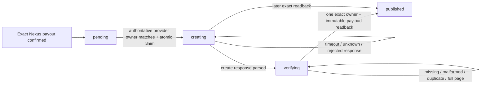
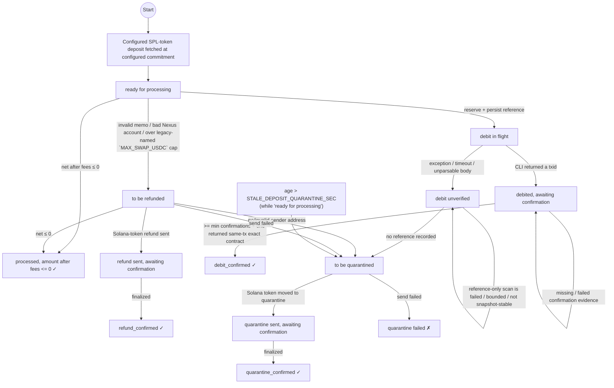
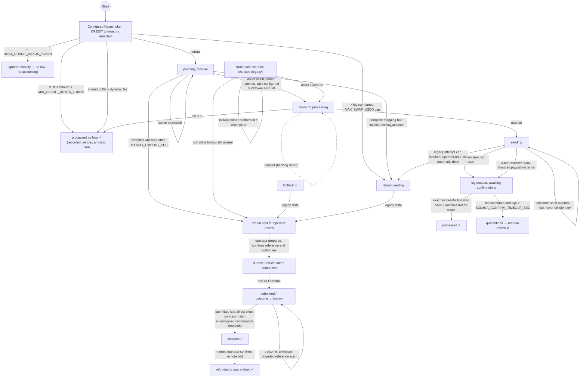

# Swap Service State Machines

State machine diagrams for both directions of the service's single configured Solana SPL token ↔ Nexus token pair.

> **Accuracy note (2026-06-15):** this document was re-derived directly from the code. The
> previous version contained transitions the code does not perform (notably an
> auto-refund on debit timeout, and a refund on USDC-confirmation timeout) and omitted the
> ambiguity-resolution states. Status strings below are copied verbatim from the source.
>
> **Resolution note (2026-08-24):** the independent review findings about
> bounded/failed Nexus lookups, fail-open backing checks, and Nexus waterline
> advancement are repaired in the working tree and covered by
> `tests/test_critical_safety.py`. Missing debit and receival-asset lookup values are never actionable
> automatically; incomplete enumeration holds; and only the poller may
> advance a Nexus checkpoint from scan evidence. Live-chain verification is
> still required.
>
> **Weekly review update (2026-08-28, `f614897`):** automatic Nexus refunds and
> treasury-to-quarantine movements remain disabled in the service loop. A separate
> intent-first operator workflow now persists one disposition per source credit,
> requires audited preparation/authorization/execution request, executes once, holds
> ambiguous outcomes, resolves only an exact positive reference/source/destination/
> amount/txid match, and archives only after explicit remote-txid confirmation. This
> protocol and empty Nexus enumeration semantics have not passed the target-node
> crash/pagination matrix, so they are release gates rather than production evidence.
>
> **Weekly review update (2026-08-29, committed `5e7d3b8` plus a separately
> staged proposal):** startup demotes persisted `executing` Nexus transfer
> intents to `outcome_unknown`, and explicit production mode requires payout
> caps and an alert route. Reconciliation still does not latch an exposure pause
> on error/unhealthy output. The staged remote scan includes active recipients
> and refuses multi-page ambiguity, but its exact valid new-recipient case and
> target-node one-page boundary/order semantics remain unproven. See
> `DEVELOPMENT_REVIEW_2026-08-29.md`.
>
> **Weekly review update (2026-08-31, `cc175cb`):** reconciliation now
> latches an exposure pause until an explicit healthy read-back; malformed
> production mode and zero-exit admission are fixed; and submitted transfer
> txids are immutable. Production remains hard-blocked. Empty successful Nexus
> enumeration can still advance the waterline; exact debit resolution collapses
> multiple contracts in one txid; confirmation-count polling does not read back
> the submitted mint's full contract terms; and remote reconciliation cannot
> prove more than one page. See `DEVELOPMENT_REVIEW_2026-08-31.md`.
>
> **Follow-up review (2026-08-31 16:16, `368b064`):** empty enumeration now
> holds, returned evidence preserves contract ids, and confirmation polling
> attempts full-term read-back. The implementation still treats one candidate
> from an incomplete bounded lookup as globally unique, does not normalize the
> target API's nested endpoint-address objects, compares a register address to
> the token-name label, and omits contract id from terminal durable state.
> Production remains hard-blocked; see `DEVELOPMENT_REVIEW_2026-08-31_1616.md`.
>
> **Follow-up review (2026-09-01, `aa71066`):** incomplete reference scans
> now hold, returned endpoint objects are normalized, submitted txids are read
> directly, terminal rows retain `contract_id`, production requires the token
> register and a multiuser session, and logging/common-transport gaps are locally
> repaired. The direct transfer resolver nevertheless terminalizes a transaction
> without checking confirmations; reference-only unknown outcomes have no complete
> stable-range path; and completed-mint reconciliation does not consume the stored
> contract id or require the configured token-register source. Production remains
> hard-blocked; see `DEVELOPMENT_REVIEW_2026-09-01.md`.
>
> **Follow-up review (2026-09-02, `8f9a30f`):** completed-mint reconciliation
> now consumes the persisted contract id and configured token-register source,
> and direct txid lookup holds below the configured confirmation threshold. The
> threshold is not constrained positive, reference-only evidence has no finality
> field, zero-input/positive-output terminal mints can reconcile healthy, and the
> target-node matrix remains unrun. Production remains hard-blocked; see
> `DEVELOPMENT_REVIEW_2026-09-02.md`.
>
> **Follow-up review (2026-09-03, `8769dcf`):** positive finality, strictly
> positive completed-mint inputs and canonical fee policy are now enforced and
> covered by the green suite. Startup reconstruction, however, does not preserve
> the live Nexus-credit dust/minimum/cap/fee transitions: positive-output
> below-minimum or over-cap credits can be queued for payout, and fee-only
> recovery omits exact-unit/fee-ledger evidence. Live polling and recovery must
> share one classifier. Production remains hard-blocked; see
> `DEVELOPMENT_REVIEW_2026-09-03.md`.
>
> **Follow-up review (2026-09-05, `c2d07aa`):** live and recovery Nexus
> enumeration now target the canonical treasury account, one strict top-level
> heartbeat DTO is shared by runtime and recovery, and old custody waterlines are
> no longer moved forward. Incoming state is still keyed by `txid`, so a transaction
> with multiple treasury CREDIT contracts is rejected atomically and holds the
> waterline rather than being silently truncated. Malformed qualifying recovery
> evidence, mutable offset pagination and non-latching startup failure remain open.
> Production remains hard-blocked; see `DEVELOPMENT_REVIEW_2026-09-05.md`.
>
> **Follow-up review (2026-09-07, committed `6568446` plus one preserved red test):**
> live/recovery admission and the four Nexus lifecycle tables now preserve
> `(txid, contract_id)`, valid sibling CREDITs are admitted independently, and
> malformed qualifying recovery evidence is rejected. Composite identity is not
> end to end: operator intents/finalization remain txid-only and can delete a
> sibling, while wipeout reconstruction misparses the composite Solana payout memo
> and can requeue an already-paid credit. Mutable offset pagination and non-latching
> startup recovery remain open. Production remains hard-blocked; see
> `DEVELOPMENT_REVIEW_2026-09-07.md`.
>
> **Development review (2026-09-08, `917505b`):** the subsequent exact
> payout-evidence repair remains present. Opt-in Solana→Nexus receipts now freeze one
> publication obligation with exact payout finalization and use an at-most-once
> create/readback protocol. Receipt creation spends NXS according to current upstream
> API documentation and has no NXS budget/accounting control or target-node acceptance,
> so it remains production-disabled. The main Nexus→Solana helper still bypasses the
> configured rolling payout cap. See `DEVELOPMENT_REVIEW_2026-09-08.md`.

---

## Current safety repair — 2026-09-07 working tree

The runtime supports exactly one pair selected by `config.SWAP_PAIR`: one classic SPL Token
Program mint and one Nexus token register. Symbols are display metadata. Multi-pair routing and
Token-2022 are not implemented. Persisted USDC/USDD column names, status values, reservation kinds,
and retry keys remain literal compatibility contracts and are shown unchanged where applicable.
Canonical pair inputs are `SOLANA_TOKEN_MINT`, `SOLANA_VAULT_ACCOUNT`, `SOLANA_TOKEN_SYMBOL`,
`SOLANA_TOKEN_DECIMALS`, `NEXUS_TOKEN_NAME`, `NEXUS_TOKEN_REGISTER_ADDRESS`,
`NEXUS_TREASURY_ACCOUNT`, and `NEXUS_TOKEN_DECIMALS`.

The dated notes above are baseline history. The [post-change report](POST_CHANGE_REVIEW_2026-09-07.md)
controls current implementation evidence. Both operator dispositions and payouts bind the exact
Nexus source `(txid, contract_id)`. Legacy identity remains held. Startup requires complete recovery
before entering the exposure-producing loop; missing/zero checkpoints and incomplete scans abort.
Mutable multi-page offset enumeration cannot establish completeness, in recovery or live polling.
Positive credits may be retained, but requesting any page beyond offset zero holds the checkpoint.

Payout preparation atomically freezes output/fee units and claims the source before RPC. The send
helper submits only: it cannot fabricate a terminal source row or a pseudo-txid idempotency marker.
Finalization requires successful finalized transaction evidence binding the exact source memo,
signature, vault signer/source, mint, recipient and integer output to the frozen intent. A confirmation
status or memo alone is not settlement. Only then does one transaction archive terminal evidence,
book its unique fee and remove that source. Missing/mismatched evidence, missing frozen terms,
failed liquidity reads and ambiguous signatures hold rather than resubmit or refund.
Only pending admission resolves a destination; it cannot reopen an operator hold.

## Optional receipt publication state machine

`NEXUS_SWAP_RECEIPTS_ENABLED` defaults false. When enabled, exact Solana→Nexus payout
finalization inserts the immutable `swap_receipts` obligation in the same SQLite transaction as
the completed payout, fee entry and source-row removal. Publication is not evidence used to retry,
refund or reissue the payout.



`creating` is an accepted-until-proven-otherwise boundary: restart performs readback and never
submits a second create. This prevents duplicate receipt assets from an ambiguous result. It does
not make the operation non-financial: current upstream Nexus API documentation assigns NXS fees to
asset and optional-name creation. No receipt NXS budget or fee ledger exists, and the target node
has not established filtered-list completeness or indexing visibility. An existing fixed-field v1
registration also cannot add `receipt_schema` through a heartbeat update. Receipt mode therefore
remains a separately gated, default-disabled extension.

## Solana token → Nexus token state machine



### Solana token → Nexus token state descriptions

| State | Description | Table | Status value |
|-------|-------------|-------|--------------|
| **Detected** | Deposit fetched from Solana (at `SOLANA_DEPOSIT_COMMITMENT`, default `finalized`) | `unprocessed_sigs` | `"ready for processing"` on insert |
| **ReadyForProcessing** | Awaiting validation + debit | `unprocessed_sigs` | `"ready for processing"` |
| **DebitInFlight** | Reference persisted, Nexus debit issued, outcome not yet known | `unprocessed_sigs` | `"debit in flight"` |
| **DebitUnverified** | Debit outcome **ambiguous** — resolved against the chain, never guessed | `unprocessed_sigs` | `"debit unverified"` |
| **DebitedAwaiting** | A submitted txid is stored. After the separate confirmation count reaches the threshold, direct txid read-back must match reference, configured token-register source, destination and exact units; endpoint objects are normalized and the selected contract id is retained. Missing or failed evidence remains held. Target-node response/finality behavior remains a release gate. | `unprocessed_sigs` | `"debited, awaiting confirmation"` |
| **Processed** | One exact DEBIT contract passed the local confirmation/read-back checks; terminal evidence includes `txid` and `contract_id` | `processed_sigs` | `"debit_confirmed"` |
| **ProcessedAsFees** | Amount after fees ≤ 0 | `processed_sigs` | `"processed, amount after fees <= 0"` |
| **ToBeRefunded** | Validation failed or amount exceeds the configured cap; ambiguity alone never refunds | `unprocessed_sigs` | `"to be refunded"` |
| **RefundSent** | Solana-token refund broadcast | `unprocessed_sigs` | `"refund sent, awaiting confirmation"` |
| **RefundConfirmed** | Refund finalized | `refunded_sigs` | `"awaiting confirmation"` → `"refund_confirmed"` |
| **ToBeQuarantined** | Solana-side refund impossible or attempts spent | `unprocessed_sigs` | `"to be quarantined"` |
| **QuarantineSent** | Solana token moved to `SOLANA_QUARANTINE_ACCOUNT` (`USDC_QUARANTINE_ACCOUNT` is the legacy alias) | `unprocessed_sigs` | `"quarantine sent, awaiting confirmation"` |
| **QuarantineConfirmed** | Quarantine finalized | `quarantined_sigs` | `"awaiting confirmation"` → `"quarantine_confirmed"` |
| **QuarantineFailed** | Quarantine send failed | `unprocessed_sigs` | `"quarantine failed"` |

> **Ambiguity is never treated as failure.** `debit_nexus_token_with_txid()` returns `(False, None)`
> both when the CLI failed *and* when it succeeded but the response could not be parsed.
> Refunding on that signal could issue the Nexus token **and** return the Solana token. Instead the row goes to
> `debit unverified` and `resolve_unverified_debits()` asks the chain, keyed on the unique
> per-attempt `reference` persisted *before* the call.

---

## Nexus token → Solana token state machine



### Nexus token → Solana token state descriptions

| State | Description | Table | Status value |
|-------|-------------|-------|--------------|
| **Ignored** | Below `DUST_CREDIT_NEXUS_TOKEN` (legacy alias `DUST_CREDIT_USDD`) — spam floor, deliberately no trace | — | — |
| **FeesRecorded** | Below `MIN_CREDIT_NEXUS_TOKEN` (legacy alias `MIN_CREDIT_USDD`) or ≤ fees; **recorded per `(txid, contract_id)`** so funds stay traceable; fee journal and terminal classification commit atomically per source contract | `processed_txids` | `"processed as fees"` |
| **Pending** | Credit queued by exact `(txid, contract_id)`, awaiting asset mapping | `unprocessed_txids` | `"pending_receival"` |
| **Ready** | Mapping resolved and owner-verified | `unprocessed_txids` | `"ready for processing"` |
| **Sending** | Exact `payout_solana_units` / `payout_fee_nexus_units` frozen and one-shot source claimed before RPC; ambiguous results never reopen READY | `unprocessed_txids` | `"sending"` |
| **Awaiting** | Awaiting full finalized payout evidence matching the frozen terms; a stored signature alone is insufficient | `unprocessed_txids` | `"sig created, awaiting confirmations"` |
| **Processed** | Exact successful finalized payout evidence matches source identity, vault, mint, recipient and output; atomic fee journal and exact source removal | `processed_txids` | `"processed"` |
| **TradeBal** | Legacy mapping-timeout recheck; complete absence now holds | `unprocessed_txids` | `"trade balance to be checked"` |
| **Collecting** | Legacy refund state converted to a hold | `unprocessed_txids` | `"collecting refund"` |
| **RefundPending** | Legacy refund state converted to a hold | `unprocessed_txids` | `"refund pending"` |
| **RefundHold** | Refund/quarantine requires operator review; no automatic Nexus debit | `unprocessed_txids` | `"refund held for operator review"` |
| **IntentAuthorized** | Named operator authorizes one exact held `(source_txid, source_contract_id)` after source revalidation. Legacy source identities cannot authorize execution. | `nexus_transfer_intents` | `"authorized"` |
| **IntentOutcome** | CLI result is submitted or unknown. A submitted outbound txid can resolve from one exact direct transaction contract only after the configured confirmation threshold; an `outcome_unknown` reference-only row remains held because the live-offset history scan cannot prove a complete range. | `nexus_transfer_intents` | `"submitted"` / `"outcome_unknown"` |
| **IntentCompleted** | Exact outbound txid/contract/reference/endpoints/units and distinct source contract identity are retained. Finalization still requires explicit operator evidence. | `nexus_transfer_intents` | `"completed"` |
| **Disposition** | Atomic exact-source terminal state, audit and queue deletion preserve sibling liabilities. Conflicting evidence or legacy source identity refuses finalization. | transfer + terminal table | `"refund_confirmed_by_operator"` / `"quarantine_confirmed_by_operator"` |
| **Quarantined** | Ambiguous Solana-token payout evidence, manual review | `unprocessed_txids` | `"quarantined"` |

> **A Solana-payout confirmation timeout quarantines — it does not refund.** The Solana token may in fact
> have been sent and only the lookup failed; refunding would pay twice.

### Processing Priority Order (`process_unprocessed_txids`)

| Priority | Status handled | Action | Skipped while paused |
|----------|----------------|--------|----------------------|
| 1 | `pending_receival` (confirmations > 1) | Resolve `receival_account` by (`txid_toService`, `owner`) | No |
| 2 | `ready for processing` | Successful liquidity check, durable term/claim transaction, then send with memo `nexus_txid:<txid>:<contract_id>` | **Yes** |
| 3 | `sending` / `sig created, awaiting confirmations` | Both stored and memo-discovered signatures require full finalized payout evidence matching frozen terms before atomic fee/terminal finalization; evidence-only recovery is allowed while paused | No |
| 4 | `trade balance to be checked` | Retry lookup, else hold for operator review | No |
| 5 | `collecting refund` | Convert legacy state to an operator hold | No |
| 6 | `refund pending` | Convert legacy state to an operator hold | No |

---

## Paused Mode (Backing Deficit)

When `fees.maintain_backing_and_bounds()` reports a deficit (configured Solana-vault backing below
`BACKING_DEFICIT_PAUSE_PCT`% of configured Nexus-token circulation), the loop does **not** skip the cycle.
It runs both pollers with `paused=True`:

| Continues | Stops |
|-----------|-------|
| Solana-token refunds, quarantine, confirmation checks | New deposit ingestion |
| Nexus-credit holds and evidence-only ambiguity resolution | Solana→Nexus debits |
| Waterline held (no fetch ⇒ no advance) | Nexus→Solana payouts |

A failure of the backing check itself also fails safe to paused. A `backing_deficit_pause`
alert is emitted.

---

## Timeouts & Retry

| Timeout | Config | Default | Applies to | Handler |
|---------|--------|---------|-----------|---------|
| Asset-mapping timeout | `REFUND_TIMEOUT_SEC` | 3600s | **Nexus→Solana only** | `process_unprocessed_txids()` P1 |
| Solana-payout confirmation timeout | `SOLANA_CONFIRM_TIMEOUT_SEC` | 600s | Nexus→Solana → **quarantine** | `process_unprocessed_txids()` P3 |
| Ambiguous Nexus debit | N/A | held until positive reference evidence or manual resolution | Solana→Nexus; a negative, failed or incomplete lookup never authorizes an automatic retry/refund | `resolve_unverified_debits()` |
| Stale deposit | `STALE_DEPOSIT_QUARANTINE_SEC` | 86400s | Solana→Nexus | `_process_stale_deposits()` |

**Retry:** `MAX_ACTION_ATTEMPTS` (3) attempts, with `ACTION_RETRY_COOLDOWN_SEC` (300s)
enforced between them. `should_attempt()` returns False for *either* reason;
`attempts_exhausted()` distinguishes them, so a cooldown never causes a premature
quarantine. After exhaustion, eligible Solana-side actions may move the configured token to
`USDC_QUARANTINE_ACCOUNT`. Nexus-side automatic treasury-to-quarantine transfers
remain disabled; the source enters an operator hold and can move only through the
audited durable-intent workflow.

---

## State Persistence

| Table | Purpose |
|-------|---------|
| `unprocessed_sigs` / `processed_sigs` / `refunded_sigs` / `quarantined_sigs` | Solana→Nexus lifecycle (legacy column names retained) |
| `unprocessed_txids` / `processed_txids` / `refunded_txids` / `quarantined_txids` | Nexus→Solana lifecycle (legacy column names retained), composite primary key `(txid, contract_id)`; legacy rows use `-1` |
| `attempts` | Retry counters + `last_timestamp` (cooldown) |
| `nexus_transfer_intents` / `nexus_transfer_audit_events` | Immutable outbound Nexus debit inputs, exact `(source_txid, source_contract_id)` identity and operator evidence; legacy source identities remain held |
| `reservations` | Cross-worker mutual exclusion on money actions |
| `counters` | Atomic Nexus debit `reference` sequence |
| `payouts` | Outbound Solana-token ledger for the rolling 24h cap |
| `fee_entries` / `fee_summary` | Authoritative fee ledger |
| `waterline_proposals` / `heartbeat` | Waterline plumbing and last known-good values |
| `accounts` | Cached balances |

SQLite runs in **WAL** mode (set in `init_db()`).

### Frozen persisted compatibility values

These names still contain the original pair labels because changing a persisted key could reset a
retry budget or bypass an in-flight reservation. Current callers therefore retain:

```text
reservations.kind: usdc_to_usdd_debit
attempts.action_key prefixes:
  usdd_debit:  usdc_refund:  usdc_quarantine_send:  usdc_quarantine:
  usdc_send:   usdd_refund:  usdd_refund_unresolved:
  usdd_refund_pending:  usdd_collect_refund:
```

For a current Nexus payout the argument passed to `payout_attempt_key()` is composite, producing
`usdc_send:<txid>:<contract_id>`. Older Nexus disposition keys remain txid-only compatibility data.

### Idempotency Guarantees

**Solana token → Nexus token**
- Solana signature is the primary key; `processed`/`refunded`/`quarantined` sets are checked before acting.
- A unique `reference` is persisted **before** each debit and is the on-chain lookup key for ambiguity resolution.
- `reserve_action("usdc_to_usdd_debit", sig)` prevents two workers acting on one deposit.
- Refund/quarantine sends carry `refundSig:<sig>` / `quarantinedSig:<sig>` memos, checked on-chain before a retry re-sends.

**Nexus token → Solana token**
- Live admission, wipeout Nexus admission and all four lifecycle tables use
  `(txid, contract_id)`. Valid sibling CREDIT contracts can therefore be queued and normally
  terminalized independently; legacy pre-migration rows retain `contract_id=-1`.
- Mapping remains transaction-level on (`txid_toService`, `owner`), while new Solana sends carry
  `nexus_txid:<txid>:<contract_id>` and the resulting signature is stored on the exact queue row.
- Strict memo parsing and positive source/output reconstruction preserve the exact paid source;
  sparse, legacy or ambiguous evidence cannot create a terminal marker or release a liability.
- Transfer intents, operator selection and finalization bind the exact source contract. Finalization
  archives and removes only that source, preserving siblings and rejecting conflicting evidence.
- Mutable multi-page Nexus offsets hold live checkpoints and cannot establish recovery completeness.
  Startup refuses incomplete recovery before exposure-producing loops begin.
- Solana recovery transaction lookups and its pagination cursor use the installed SDK's `Signature`
  value objects. Invalid signature/cursor values hold recovery with explicit incomplete reasons.
  Offline real-SDK request-construction tests do not replace target-chain acceptance.

---

## Waterline Invariant

`_advance_solana_waterline()` may only move the Solana waterline to a point proven safe:

| Situation | Waterline |
|-----------|-----------|
| Deposit enumeration failed | held entirely |
| Unprocessed deposits exist | pinned behind the oldest |
| Deposit withheld pending finalization | pinned behind it |
| Everything fetched is persisted | `poll_start − HEARTBEAT_WATERLINE_SAFETY_SEC` |
| Candidate ≤ current | unchanged (never moves backwards) |

A waterline read ahead of *now* is clamped. **The waterline must never pass a deposit that
is not durably recorded** — `_fetch_deposits_helius` stops at `ts <= since_ts`, so anything
left behind it is never seen again.

The Nexus poller applies the same proof rule:

| Nexus enumeration state | Waterline |
|---|---|
| CLI exception/non-zero exit, API error, malformed response | **held entirely** |
| A nonzero mutable offset was requested, even if the later page is short or empty | **held entirely**; positive persisted credits do not prove complete enumeration |
| Full page budget or processing budget exhausted | held (`pagination_truncated`), even when active rows exist |
| Unprocessed credits exist after a complete poll | poller may pin behind the oldest |
| Complete scan with persisted page data | may advance to the oldest scanned timestamp minus safety |
| Empty successful unfiltered response | **held** (`empty_enumeration_unproven`); absence from a live endpoint is not proof of a complete stable range |
| Processing pass | always held; it has no scan evidence and never proposes a waterline |

That empty-result rule is the **live poller** rule. Startup's bounded
`fetch_deposits_since()` currently reports an empty first page as complete for the requested
checkpoint range, while refusing any scan that requests a later mutable-offset page. This
difference is current code behavior, not proof that target-node empty-history semantics are safe.

A missing Nexus transaction or reference is **never** an automatic proof of
non-execution: the history endpoint is live and offset pagination has no snapshot
guarantee. Only a positive txid/reference match is actionable automatically. Negative,
error, and exhausted-pagination results remain `incomplete` and require manual
resolution rather than authorizing retry or refund.

---

## Code Locations

| Component | File | Function |
|-----------|------|----------|
| Solana→Nexus polling | `src/swap_solana.py` | `poll_solana_deposits()` |
| Waterline advance | `src/swap_solana.py` | `_advance_solana_waterline()` |
| Solana→Nexus processing | `src/solana_client.py` | `process_unprocessed_solana_deposits()` |
| Ambiguity resolution | `src/nexus_client.py` | `resolve_unverified_debits()`, `find_nexus_debit_by_reference()` |
| Solana-token refunds / quarantine | `src/solana_client.py` | `process_solana_deposits_refunding()`, `process_solana_deposits_quarantine()` |
| Nexus→Solana polling | `src/swap_nexus.py` | `poll_nexus_deposits()` |
| Nexus→Solana processing | `src/swap_nexus.py` | `process_unprocessed_txids()` |
| Legacy Nexus quarantine helper (not called by the automatic loop) | `src/nexus_client.py` | `quarantine_nexus_token()` |
| Held-credit operator disposition | `nexus_transfer_operator.py` | `prepare`, `authorize`, `execute`, `resolve`, `finalize` |
| Alerting | `src/alerts.py` | `critical()`, `warning()`, `info()` |
| Startup recovery | `src/startup_recovery.py` | `perform_startup_recovery()` |

### Status constants (`src/swap_nexus.py`)

```python
NEXUS_STATUS_PENDING          = "pending_receival"
NEXUS_STATUS_READY            = "ready for processing"
NEXUS_STATUS_SENDING          = "sending"
NEXUS_STATUS_AWAITING         = "sig created, awaiting confirmations"
NEXUS_STATUS_REFUNDED         = "refunded"
NEXUS_STATUS_PROCESSED        = "processed"
NEXUS_STATUS_FEES             = "processed as fees"
NEXUS_STATUS_REFUND_PENDING   = "refund pending"
NEXUS_STATUS_REFUND_HOLD      = "refund held for operator review"
NEXUS_STATUS_QUARANTINED      = "quarantined"
NEXUS_STATUS_TRADE_BAL_CHECK  = "trade balance to be checked"
NEXUS_STATUS_COLLECTING_REFUND = "collecting refund"
```

Solana-side statuses are string literals in `src/solana_client.py` / `src/nexus_client.py`
(listed in the table above) rather than named constants.

> **Known inconsistency:** `_process_stale_deposits()` also matches a `'memo unresolved'`
> status that no code path ever writes. Harmless, but it is dead.

---

## Monitoring

```sql
-- state distribution
SELECT status, COUNT(*) FROM unprocessed_sigs  GROUP BY status;
SELECT status, COUNT(*) FROM unprocessed_txids GROUP BY status;

-- ambiguous debits needing chain resolution (should drain quickly)
SELECT sig, reference, status FROM unprocessed_sigs
WHERE status IN ('debit in flight','debit unverified');

-- rolling 24h outbound Solana-token units vs cap
SELECT COALESCE(SUM(amount_usdc_units),0) FROM payouts
WHERE timestamp >= strftime('%s','now') - 86400;

-- legacy-named Nexus quarantine records (automatic moves are disabled)
SELECT txid, amount_usdd, status FROM quarantined_txids ORDER BY timestamp DESC;
```

Alerts (`ALERT_WEBHOOK_URL` / `ALERT_COMMAND`) fire on: `backing_deficit_pause`,
`unbacked_usdd_surplus`, `heartbeat_unreadable`, `heartbeat_asset_invalid`,
`insufficient_vault_liquidity`, `payout_cap_exceeded`, `swap_over_cap`, `usdd_quarantined`.

---

## References

- User-facing flow: [SWAP_INITIATOR_STATE_MACHINES.md](SWAP_INITIATOR_STATE_MACHINES.md)
- Configuration: [CONFIG.md](../CONFIG.md)
- Security hardening: [SECURITY.md](SECURITY.md)
- Operational setup: [SETUP.md](../SETUP.md)
- Risk assessment: [RISK_ASSESSMENT.md](RISK_ASSESSMENT.md)
