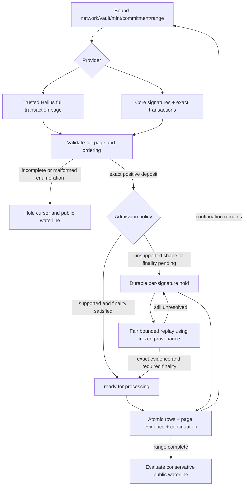
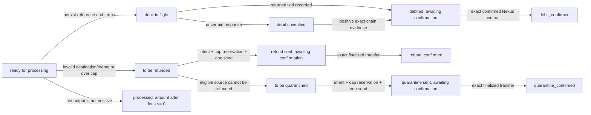
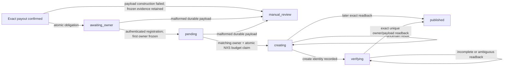

# Swap Service State Machines

**Scope:** one configured classic SPL token ↔ Nexus token pair. This describes the current
working candidate; offline gates and independent ingestion closure review passed.
See [EVALUATION.md](EVALUATION.md) for current approval status. Historical dated notes and the full
previous diagrams are preserved in the [pre-repair snapshot](POST_CHANGE_REVIEW_2026-09-13_PRE_REPAIR_DOCUMENTATION.md).

## Safety boundaries

- Immutable token/custody identities and integer base units control financial decisions; symbols
  are display metadata. Existing database columns and status strings remain compatibility contracts.
- Each irreversible action persists its intent and budget before one submission. An uncertain result
  retains its liability and can resolve only through authoritative positive evidence or explicit
  operator disposition; it does not authorize automatic retry/refund.
- A returned signature or finalized status is not sufficient settlement proof. Match transaction
  success, source identity, vault/mint, exact recipient and output against frozen intent.
- Payout completion, fee booking and exact source removal commit atomically. Nexus source identity
  is `(txid, contract_id)` so settling one sibling cannot delete another.
- Incomplete recovery prevents the exposure-producing service loop from starting. Paused operation
  continues evidence-only resolution and existing refund/quarantine work, not new bridge exposure.

## Solana deposit enumeration and holds

Helius is trusted; core RPC is not a mandatory second attestor. Bind provider continuations to
network, vault, mint, commitment and fixed range/query parameters. Never reinterpret a Helius token
as a core `before` signature or resume it under changed query terms.

**Hold requirements:** retain the positive integer principal, exact evidence and immutable provenance.
Include held principal in unresolved backing liabilities; unknown amounts make authorization unhealthy.
Read hold and pending totals in one SQLite snapshot so concurrent promotion cannot omit principal.
Finalized configuration cannot retroactively bless evidence observed at confirmed commitment.
Validate the actual provider endpoint/network before every replay promotion, even when stored
evidence is already finalized and needs no new status request; missing/conflicting endpoints retain the hold.
Status queries obey provider batch limits, and replay cannot repeatedly select only a permanently
unsupported oldest window.

Ordinary classic SPL `transfer` and `transferChecked` share exact vault-balance validation. An outer
ATA creation and its matching inner initialization form one logical creation. Multiple incoming
sources or memos remain held when one payable source/destination cannot be established. Every positive
deposit enters the liability/fee/refund lifecycle; processing minimums must not silently filter history.

## Public waterlines and database loss

| Evidence | Permitted public waterline behavior |
|---|---|
| RPC error, malformed page, incomplete range or paused/no enumeration | Do not advance |
| In-progress provider continuation | Persist local page progress, not a completed range |
| Unprocessed or held Solana deposits | Pin behind the oldest unresolved source |
| Complete range, all obligations reconstructible | Advance only to the proven bound with safety margin |
| Proposed value does not exceed current value | Leave unchanged |
| Nexus processing-only pass | Never propose a checkpoint |
| Nexus mutable multi-page offset scan | Hold; positive rows do not establish complete enumeration |
| Empty live Nexus enumeration | Hold as unproven absence |

A durable **local** hold is not enough to pass an **external** recovery checkpoint: the local
record can disappear with the database. Either keep the public checkpoint behind it or demonstrate
complete reconstruction before startup succeeds. Do not initialize or move checkpoints to “now” to
bypass custody history. A policy/configuration mismatch must not silently reinterpret a saved cursor.

Nexus startup currently accepts an empty first bounded page while rejecting a later mutable-offset
page. The stricter live-poller rule differs; target-node completeness semantics remain an acceptance
gate, not something local fixtures prove.

## Solana token → Nexus token lifecycle

The diagram omits nonterminal retry/hold loops, not their controls. Unknown Nexus mint outcomes
cannot be converted into a Solana refund merely because a bounded lookup is empty. Refund/quarantine
workers freeze the source, resolved token-account recipient, exact output and versioned memo before
submission; legacy rows without frozen terms remain held. Receipt publication never reopens this
bridge payout lifecycle.

## Nexus token → Solana token lifecycle

| Persisted state | Transition rule |
|---|---|
| `pending_receival` | Require complete mapping evidence and authoritative owner/token-account match |
| `ready for processing` | Successful liquidity/admission checks, then atomically freeze payout/fee terms and reserve cap |
| `payout cap held` | Retry admission when capacity is available; no submission occurred |
| `sending` | Single submission claim; ambiguous outcome remains held |
| `sig created, awaiting confirmations` | Require full finalized payout proof matching frozen terms |
| `processed` | Fee, exact terminal evidence and sibling-scoped source removal committed |
| `processed as fees` | Exact per-contract fee classification for the supported dust/minimum policy |
| `refund held for operator review` | No automatic Nexus debit; use the separate audited intent workflow |
| Legacy `collecting refund`, `refund pending`, `trade balance to be checked` | Retain compatibility, resolve/hold conservatively; no blind automatic refund |

Current outgoing payout memos carry `nexus_txid:<txid>:<contract_id>`. Automatic Nexus refund and
quarantine transfers remain disabled. The operator protocol is prepare → named authorization →
execute once → positive chain resolution → exact-source finalize. A submitted txid is immutable;
an unresolved reference-only scan cannot authorize a second debit.

## Recovery and rolling-cap accounting

Current Solana disposition memos are `swapService:v1:refund:<source_signature>` and
`swapService:v1:quarantine:<source_signature>`. Recovery requires exact finalized successful outbound
transfer evidence and the corresponding finalized incoming deposit: source token account, vault,
mint, amount, memo and authoritative chronology. A conflicting active Nexus mint lifecycle holds
reconstruction instead of erasing a possible mint-and-refund conflict. Missing source memos use the
same representation as normal persisted deposits.

Reconstruction restores terminal disposition, fee and cap events atomically and idempotently.
Confirmed cap consumption uses chain time, including refunds/quarantine before a newer heartbeat.
The whole rolling window must be covered even when the recovery checkpoint is newer. Known primary
payout identities preserve paid Nexus siblings; unpaid siblings remain independently recoverable.
Unknown, malformed, encoded, legacy or unattributed vault spending keeps recovery incomplete.

## Optional receipt publication state machine

`receipt_contract.py` owns the immutable payload schema and deterministic name. The database still
independently binds receipt fields to the exact completed payout. Owner lookup is not part of payout
finalization. A bound owner cannot be overwritten; mismatches hold publication. Malformed evidence
is retained for manual review, never silently discarded or published.

`creating` is a one-shot boundary: restart reads back and never blindly recreates. Its NXS budget
reservation remains charged across unknown outcomes. Production still rejects receipt enablement
pending live cost, indexing/readback and registration-migration acceptance. Existing fixed-field v1
records cannot gain a receipt schema through a heartbeat update.

## Durable stores and monitoring

| Store | Authority |
|---|---|
| Four `*_sigs` lifecycle tables | Solana source obligations and terminal evidence |
| Four `*_txids` lifecycle tables | Composite Nexus source obligations and terminal evidence |
| Provider cursor/event tables | Bound page continuation and completion evidence |
| `solana_deposit_holds` | Unresolved principal, evidence, provenance and replay state |
| `solana_payout_budget_events` | Per-obligation reserved/submitted/confirmed/released cap accounting |
| `nexus_transfer_intents` / audit events | Immutable operator disposition and attribution |
| `swap_receipts` / `receipt_nxs_budget_events` | Publication obligation and NXS reservation |
| `fee_entries` | Authoritative integer fee journal |

SQLite uses WAL. Use `state_db.payout_budget_used(86400)` for rolling usage rather than summing one
ledger by hand. Inspect unresolved lifecycle rows, holds, manual-review receipts and unresolved cap
reservations together. Primary cap refusal has a durable dashboard-visible state; disposition cap
refusal currently retains generic source states and structured diagnostics.

Frozen compatibility examples include `reservations.kind=usdc_to_usdd_debit`, the
`usdc_send:<txid>:<contract_id>` attempt key, legacy fee/table columns and existing status strings.
Do not rename or delete them as cosmetic cleanup while old databases may contain active obligations.

For settings/timeouts see [CONFIG.md](../CONFIG.md); for operator procedures see
[SETUP.md](../SETUP.md) and [SECURITY.md](SECURITY.md). The runtime entrypoints are
`poll_solana_deposits`, `poll_nexus_deposits`, `process_unprocessed_txids`,
`check_unconfirmed_debits`, and `perform_startup_recovery` in their respective `src/` modules.
